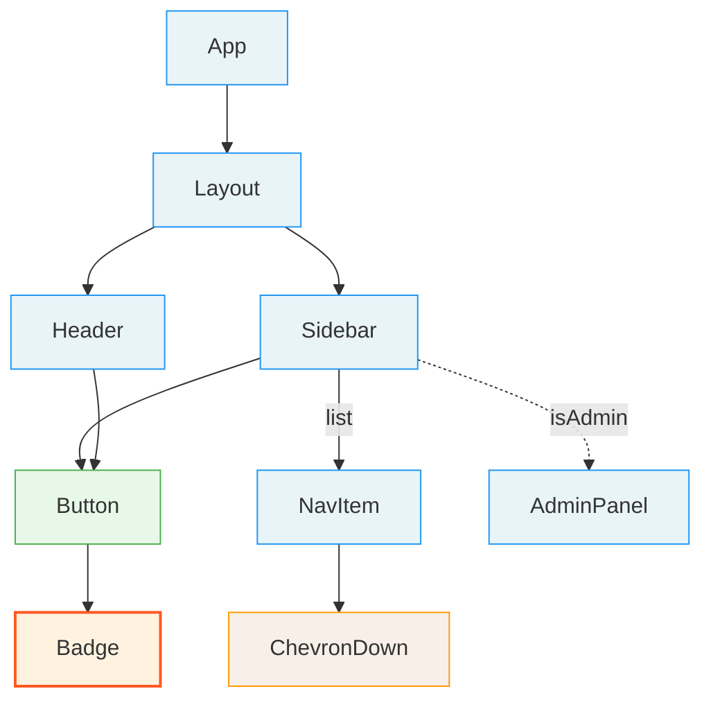

# Generate Build Order and Hierarchy Diagram

Read all per-component analysis files, build a dependency graph, perform a topological sort (leaves first), and produce a level-grouped build order and a Mermaid hierarchy diagram.

## Inputs

- **Component analyses**: All `analysis.md` files in `.temp/react-to-figma/components/*/`
- **Barrel map**: `.temp/react-to-figma/component-hierarchy/barrel-map.md`

## Procedure

### 1. Read all analysis files

Read every `analysis.md` file from `.temp/react-to-figma/components/*/analysis.md`.

For each component, extract:
- Component name
- Source type (project, ui-library, npm)
- Leaf flag
- List of children (from the "Rendered Children" table — just the Child column)

### 2. Resolve aliases

Use the barrel map to normalize component references. If a child in one analysis references a name that the barrel map resolves to another component's canonical name, unify them.

For example, if `Sidebar` renders `<Button>` and the barrel map shows `Button → src/components/ui/button.tsx`, and there's an analysis for `Button` at that path, connect them.

### 3. Build dependency graph

Create a directed graph where:
- Each node is a component
- An edge `A → B` means "A renders B" (A depends on B being built first)

Track edges as: `{ parent: string, child: string, relationship: string }`

### 4. Detect issues

**Circular dependencies**: If the graph contains cycles, record them as warnings. For the topological sort, break cycles by removing the edge from the component with the most dependents (it's likely a layout/wrapper component).

**Orphan components**: Components that appear in no other component's children AND have no children of their own. These may be entry points (e.g., pages) or unused components. Flag them but include them in the build order.

**Unresolved references**: Children referenced in analysis files that don't match any discovered component. These may be:
- Components missed in discovery
- Typos or renamed components
- Third-party components not in the npm scan

Record these as warnings.

### 5. Topological sort

Perform a topological sort of the dependency graph (reverse — leaves first).

Group components by **level**:
- **Level 0**: Components with no children (leaves) — these can be built first
- **Level 1**: Components whose children are ALL Level 0
- **Level 2**: Components whose children are ALL Level 0 or Level 1
- **Level N**: Components whose children are ALL Level N-1 or below

Within each level, sort alphabetically for stability.

### 6. Write `build-order.md`

Write to `.temp/react-to-figma/component-hierarchy/build-order.md`:

```markdown
# Component Build Order

Build components from the bottom up. All dependencies at lower levels must be built before starting a level.

**Total components**: {count}
**Total levels**: {count}
**Leaf components**: {count}

## Level 0 — Leaves (build first)

These components render no other project/UI components. Build these first.

- [ ] Badge | src/components/ui/badge.tsx | ui-library
- [ ] ChevronDown | lucide-react | npm
- [ ] Input | src/components/ui/input.tsx | ui-library
- [ ] Label | src/components/ui/label.tsx | ui-library

## Level 1

Dependencies listed after `←`.

- [ ] Button | src/components/ui/button.tsx | ui-library ← Badge
- [ ] FormField | src/components/common/FormField.tsx | project ← Input, Label
- [ ] NavItem | src/components/Sidebar/NavItem.tsx | project ← ChevronDown

## Level 2

- [ ] Sidebar | src/components/Sidebar/Sidebar.tsx | project ← Button, NavItem
- [ ] Header | src/components/Header/Header.tsx | project ← Button

## Level 3

- [ ] Layout | src/components/Layout/Layout.tsx | project ← Sidebar, Header

## Level 4

- [ ] App | src/App.tsx | project ← Layout

## Warnings

### Circular Dependencies
{List any cycles found, or "None detected."}

### Orphan Components
{List any orphans, or "None detected."}

### Unresolved References
{List any unresolved child references, or "None detected."}
```

### 7. Write `hierarchy.md`

Write the Mermaid diagram to `.temp/react-to-figma/component-hierarchy/hierarchy.md`:

```markdown
# Component Hierarchy


``​`

#### Mermaid style guide

| Relationship | Arrow style | Label |
|-------------|-------------|-------|
| renders | `A --> B` | (none) |
| routes | `A -->│"route: /path"│ B` | route path |
| conditional | `A -.-> B` | condition expression |
| list | `A -->│"list"│ B` | "list" |
| wraps | `A -->│"wraps"│ B` | "wraps" |
| prop-injection | `A -..-> B` | prop name |

| Source type | Class | Style |
|-------------|-------|-------|
| project | `project` | Blue border |
| ui-library | `uiLib` | Green border |
| npm | `npm` | Orange border |
| leaf (any type) | `leaf` | Thick orange-red border |

**Diagram size**: If the graph has more than 50 nodes, produce two diagrams:
1. **Overview**: Only Level 2+ components (collapse leaves and Level 1 into counts on edges, e.g., `Sidebar -->|"5 children"| ...`)
2. **Full**: All components

### 8. Return summary

Return to the parent orchestrator:

```
Build order complete.
- Total components: {count}
- Levels: {count}
- Leaf components (Level 0): {count}
- Circular dependencies: {count}
- Orphan components: {count}
- Unresolved references: {count}
- Outputs:
  - .temp/react-to-figma/component-hierarchy/build-order.md
  - .temp/react-to-figma/component-hierarchy/hierarchy.md
```
