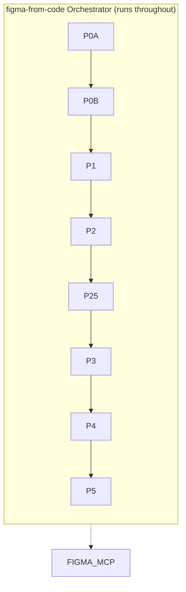
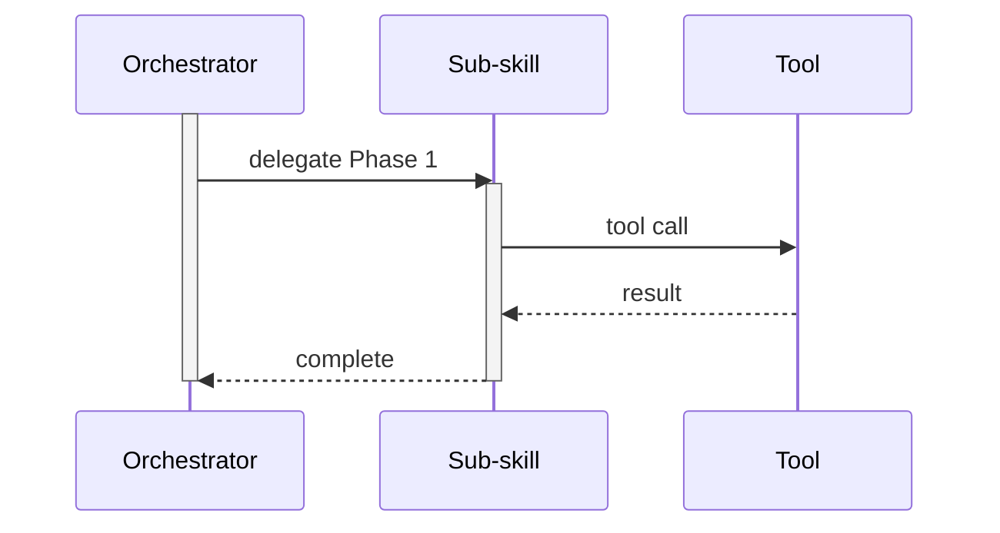

# Skill Workflow Diagrammer

Generate a visual flowchart of any Agent Skill's workflow showing phases, sub-skills, tools, and sub-agent usage.

## When to Use

- User asks to "diagram a skill", "visualize a skill workflow", or "map out how a skill works"
- User wants to understand the phases, sub-skills, tools, and sub-agent architecture of a skill

## Input

The user provides a skill name (e.g. `figma-from-code`). If no skill is provided, list all available skills from `.claude/skills/` and ask which skill to diagram.

After identifying the skill, ask the user how they want the diagram delivered:

1. **Markdown file** — Save a `.md` file with the Mermaid code block (renderable in GitHub, VS Code, etc.)
   - Follow-up: Ask where to save the file (suggest `.temp/{skill-name}-workflow.md` as default)
2. **FigJam board** — Render into a FigJam board via the Figma MCP `generate_diagram` tool
   - Follow-up: Ask the user to provide a FigJam board URL (to add to an existing board) or confirm creating a new board
3. **Other** — Any other format the user prefers
   - Follow-up: Ask the user how they want it delivered (e.g. inline in chat, HTML file, PNG via mermaid-cli, etc.)

If the user already specified a delivery method in their initial request, skip the question and proceed directly.

## Workflow

### Step 1 — Identify the target skill

If the user did not specify a skill name:

1. List all available skills from `.claude/skills/`
2. Ask the user which skill to diagram

### Step 2 — Deep-read the skill and all referenced skills

Read the target skill's `SKILL.md` thoroughly. Then identify and read every skill it references, delegates to, or spawns as a sub-agent. Continue recursively until all reachable skills are read.

For each skill, extract:

- **Phase or step** it belongs to (e.g. "Phase 0a", "Step 3")
- **Purpose** — what it accomplishes (1-2 sentences)
- **Key actions** — the concrete work it performs (these become bullet points)
- **Sub-agent usage** — whether it spawns sub-agents, what tier (basic/medium/high), and whether they run in parallel or sequentially. Map model names to tiers: haiku → basic, sonnet → medium, opus → high
- **Tool usage** — which MCP tools or scripts it calls (e.g. `use_figma`, `get_screenshot`, Playwright, Node scripts)
- **Inputs and outputs** — what files/data it consumes and produces
- **Dependencies** — which other skills or phases must complete first

### Step 3 — Build the diagram structure

Organize the collected information into a flowchart:

1. **Orchestrator node** at the top — the entry-point skill with its key responsibilities as bullet points
2. **Phase nodes** in sequential order — each phase is a node containing:
   - Phase number and skill name in the title
   - Bulleted list of key actions performed in that phase
3. **Sub-skill nodes** — any skill delegated to or called by a phase gets its own node with bullet points, connected by a dashed arrow labeled with the relationship (e.g. "delegates to", "each runs", "references")
4. **Sub-agent nodes** — where sub-agents are spawned, show a dedicated node indicating:
   - Tier used (basic / medium / high)
   - Parallelism (e.g. "5 parallel", "1 per component")
   - What each sub-agent does
5. **Tool nodes** — shared tools (Figma MCP, Playwright, etc.) shown as a single node with dashed connections from every phase that uses them
6. **File nodes** — when a phase or skill produces a file that another phase reads, create a file node for it. Use cylinder shape (`[("filename")]`) to visually distinguish files from process nodes. Connect the producing phase to the file with a solid arrow labeled `"writes"`, and the file to each consuming phase with a dashed arrow labeled `"reads"`. Only include files that flow between phases — internal intermediate files within a single phase can be omitted.
7. **Supporting skill nodes** — skills that provide reference data or are called indirectly

### Step 4 — Generate Mermaid syntax

Build a `flowchart TD` diagram following these conventions:

- **Solid arrows** (`-->`) for the sequential phase order
- **Dashed arrows** (`-.->`) for skill delegation, tool usage, and sub-agent spawning
- **Edge labels** in quotes describing the relationship (e.g. `|"delegates to"|`, `|"5 parallel basic-tier"|`, `|"use_figma"|`)
- **All node text in quotes** with `<br>` for line breaks and `- ` prefix for bullet items
- **Note:** `<b>` and other HTML tags do NOT render in FigJam — they appear as literal text. Do not use HTML formatting tags in node labels.
- **Color coding** (use `style` declarations):
  - Green (`fill:#d1e7dd,stroke:#0f5132`) — Orchestrator / entry point
  - Purple (`fill:#e8d5f5,stroke:#7b2d8e`) — Basic-tier sub-agents (e.g. haiku)
  - Yellow (`fill:#fef3c7,stroke:#d97706`) — Medium-tier sub-agents (e.g. sonnet)
  - Orange (`fill:#fed7aa,stroke:#c2410c`) — High-tier sub-agents (e.g. opus)
  - Blue (`fill:#cfe2ff,stroke:#084298`) — External tools (Figma MCP, Playwright, etc.)
  - Gold (`fill:#fff3cd,stroke:#664d03`) — Utility skills (screenshot-comparison, etc.)
  - Light gray (`fill:#f0f0f0,stroke:#666666`) — File artifacts (data flowing between phases)
  - White/default — Phase nodes and supporting skills
- **File nodes** use cylinder shape: `F_NAME[("filename")]` — this visually separates data artifacts from process nodes

After all skill nodes, add a **legend subgraph** at the bottom of the diagram. The legend uses invisible nodes and edges to display the color and arrow conventions inline:

```mermaid
subgraph LEGEND ["Legend"]
    direction LR
    L1["Orchestrator"] -.-> L2["Basic-tier sub-agent"]
    L2 -.-> L3["Medium-tier sub-agent"]
    L3 -.-> L4["High-tier sub-agent"]
    L4 -.-> L5["External tool"]
    L5 -.-> L6["Utility skill"]
    L6 -.-> L7[("File artifact")]
    L8["Solid arrow = sequential phase order / writes"]
    L9["Dashed arrow = delegation / reads / tool use"]
    style L1 fill:#d1e7dd,stroke:#0f5132
    style L2 fill:#e8d5f5,stroke:#7b2d8e
    style L3 fill:#fef3c7,stroke:#d97706
    style L4 fill:#fed7aa,stroke:#c2410c
    style L5 fill:#cfe2ff,stroke:#084298
    style L6 fill:#fff3cd,stroke:#664d03
    style L7 fill:#f0f0f0,stroke:#666666
end
```

Only include legend entries for colors and arrow types that actually appear in the diagram. If the skill has no basic-tier sub-agents, omit that entry.

### Step 4.5 — Add nesting / lifetime variants (optional)

The default `flowchart TD` does not visually express that the orchestrator runs *around* every phase — phases look like peers of the orchestrator rather than steps inside it. When this distinction matters (multi-phase orchestrators, long-lived controllers, supervisor patterns), generate one or more of these alternative views *in addition to* the primary flowchart:

#### Variant A — Subgraph containment (Mermaid)

Wrap every phase node inside a `subgraph` named after the orchestrator. The phase nodes render as children of a visible bordered box, communicating "owned by orchestrator." File artifacts, MCP tools, and utility skills stay outside the subgraph since they outlive a single run or are external.



Use `direction TB` inside the subgraph so children stack vertically. The subgraph itself can be styled with a fill to emphasize the container.

#### Variant B — Sequence diagram with activation bars

Use `sequenceDiagram` with `activate`/`deactivate`. The orchestrator's activation bar stays drawn for the entire interaction, making "still running" literal. Nested `activate` calls on sub-skills show shorter activation bars layered on top.



Best when the story is about timing/handoffs rather than data flow. Less effective for many parallel sub-agents (it gets noisy fast).

#### Variant C — Gantt chart (duration overlap)

Use `gantt` to show every phase as a horizontal bar with a single long bar across the top for the orchestrator. This makes "runs the whole time" the headline. Parallel sub-agents can be shown as overlapping bars within a phase's window.

```mermaid
gantt
  title figma-from-code phases over time
  dateFormat X
  axisFormat %s
  section Orchestrator
  runs throughout :active, o1, 0, 8
  section Phases
  Phase 0a discovery :p0a, 0, 1
  Phase 0b assets    :p0b, after p0a, 1
  Phase 1 tokens     :p1, after p0b, 1
```



Best for explaining "this is a long-running controller and these are its bounded sub-steps." Less useful for showing data flow or delegation relationships.

#### Variant D — FigJam container frames

When delivering to FigJam, wrap phase nodes inside a large parent frame labeled with the orchestrator name. Phase frames nest inside it. This is the only variant that requires the Figma MCP — use `use_figma` with `appendChild` calls to nest frames. The visual result is equivalent to Variant A but is interactive and editable.

Implementation outline (requires `figma:figma-use` skill loaded):

1. Create the outer orchestrator frame with auto-layout, sized to fit children
2. For each phase, create a child frame and `parent.appendChild(phaseFrame)`
3. Style the outer frame with a distinct fill and border to mark it as the container

#### When to use which

| Variant | Best for | Cost |
|---------|----------|------|
| Subgraph (A) | Default upgrade — minimal change from existing flowchart | Trivial |
| Sequence (B) | Timing, handoffs, request/response patterns | Rewrite |
| Gantt (C) | Emphasizing duration and overlap | Rewrite |
| FigJam frames (D) | Polished, editable deliverable | Higher (Figma MCP) |

If the user asks for "nesting" or "show that X runs the whole time," default to Variant A. Offer the others as alternatives.

### Step 5 — Deliver the diagram

Deliver based on the user's chosen format:

#### Option A: Markdown file

- Write a `.md` file containing the Mermaid code inside a ` ```mermaid ` fenced code block
- Include a brief legend explaining the color coding and arrow conventions
- Save to the path the user specified (default: `.temp/{skill-name}-workflow.md`)
- If the user asked for nesting/lifetime variants (Step 4.5), include each variant as its own section in the same file under H2 headings so they can compare side-by-side

#### Option B: FigJam board

- Use the Figma MCP `generate_diagram` tool:
  - `name`: "{Skill Name} Workflow Architecture"
  - `fileKey`: Extract from user-provided FigJam URL, or omit to create a new board
  - `mermaidSyntax`: The generated Mermaid code
  - `userIntent`: "Detailed workflow diagram of the {skill-name} skill showing phases, sub-skills, sub-agents, and tool usage"
- If the tool returns a plan key error, fall back to outputting the raw Mermaid syntax and suggest the user paste it into FigJam or mermaid.live

#### Option C: Other format

- **Inline in chat**: Output the Mermaid code block directly in the response
- **PNG**: Use `npx -y @mermaid-js/mermaid-cli mmdc -i input.mmd -o output.png` to render a PNG file
- **HTML**: Write a self-contained HTML file that renders the Mermaid diagram using the Mermaid.js CDN
- Adapt to whatever the user requested

## Example Output Structure

For a multi-phase skill like `figma-from-code`, the diagram would look like:

```
Orchestrator (green)
  │
  ├──> Phase 0a node ── delegates to ──> sub-skill node
  │
  ├──> Phase 0b node
  │
  ├──> Phase 1 node ── use_figma ──> Figma MCP (blue)
  │
  ├──> Phase 2 node ── use_figma ──> Figma MCP
  │
  ├──> Phase 2.5 node ── spawns ──> Basic-tier sub-agents (purple)
  │
  ├──> Phase 3 node ── spawns ──> Medium-tier sub-agents (yellow)
  │                                  │
  │                                  └── each runs ──> build-component (gold)
  │                                                      │
  │                                                      └── pixel diff ──> screenshot-comparison (gold)
  │
  ├──> Phase 4 node ── use_figma ──> Figma MCP
  │
  └──> Phase 5 node ── use_figma ──> Figma MCP
```

## Handling Simple Skills

Not every skill has phases or sub-agents. For simpler skills:

- Show a single main node with its action steps as bullets
- Show any tools or MCP servers it uses as connected nodes
- Show any other skills it references or delegates to
- If truly single-step with no dependencies, generate a minimal diagram with just the skill node and its tool connections

## Tips

- Read every referenced SKILL.md — don't guess at what a sub-skill does
- If a skill references scripts (`.js`, `.sh`), note them as actions but don't create separate nodes for them
- Capture the sequential vs parallel distinction clearly — it's one of the most important architectural details
- Keep bullet text concise (under 60 chars per line) so nodes stay readable in FigJam
