# Skill: Component Set Testing (Test-Driven Development)

**⚠️ CRITICAL: This skill MUST be executed BEFORE writing component implementation code.**

This skill enforces test-driven development for React components based on Figma Component Sets. Tests are written first based on Figma variants, then implementation follows to make tests pass.

## Overview

When working with Figma Component Sets, this skill automates:
1. Component creation/verification in the codebase
2. Discovery of all variant properties and their values
3. Generation of comprehensive unit tests for every combination
4. Cross-verification of values against design variables
5. Documentation of visual and behavioral differences
6. **Mandatory validation** before implementation begins

## When to Use

**⚠️ YOU WILL BE ROUTED HERE** - This skill is automatically invoked by the figma-url-router skill when a COMPONENT_SET is detected.

**DO NOT USE THIS SKILL DIRECTLY** - Instead:
1. Use figma-url-router skill when you see ANY Figma URL
2. The router will detect the node type and route you here if needed
3. If you're here, follow the TDD process exactly

**Manual override only if:**
- Auditing existing component tests for compliance
- Verifying test coverage post-implementation

## Critical Success Factors

**🛑 STOP AND READ - These are non-negotiable:**

1. **TESTS MUST BE WRITTEN FIRST** - Component file does NOT exist until Phase 6
2. **TRACKING TABLE IS MANDATORY** - Phase 3 must produce a structured table
3. **VALIDATION SCRIPT MUST PASS** - Run validate-tests.sh before implementation
4. **EVERY TEST NEEDS VARIANT COMMENTS** - Format: `// Figma Variant: Property=Value`
5. **ALL VALUES FROM DESIGN VARIABLES** - No guessing, no approximations

**If ANY of these are violated, the implementation MUST be rejected and redone.**

## Workflow Overview (Before Phase Details)

```
figma-url-router detects COMPONENT_SET
          ↓
   Phase 0: Verify Component Set
          ↓
   Phase 1: Create TEST file first (NO component yet)
          ↓
   Phase 2: Discover all variants
          ↓
   Phase 2.4: Create describe blocks with TODO placeholders
          ↓
   Phase 3: Gather test requirements from THREE sources (ALL AS TODOs)
       ├─ 3.1: Analyze variant names → predict test TODOs
       ├─ 3.2: Capture screenshots → confirm/expand test TODOs
       ├─ 3.3: Analyze spec/context → add application state TODOs
       └─ 3.4: Create tracking table from all TODOs
          ↓
   Phase 4: Verify ALL values against design variables
          ↓
   Phase 5: Implement tests (fill in TODOs from Phase 3)
          ↓
   🛑 CHECKPOINT: Phase 5.4 validation + run validate-tests.sh
          ↓
   Phase 6: NOW create component file
          ↓
   Phase 7: Red-Green-Refactor until all tests pass
          ↓
   🛑 FINAL: Run validate-tests.sh again
```

## Phase 0: Verify Component Set (DO THIS FIRST)

**MCP Tools Used:**
- `mcp_figma_get_design_context` - Verify node type is COMPONENT_SET
- `grep_search` or `file_search` - Check if component already exists

**Skills Referenced:**
- `mcp-error-handling` - Handle MCP tool errors during verification

#### 0.1 Identify the Figma Node
- Extract `fileKey` and `nodeId` from the Figma URL
- URLs follow pattern: `https://figma.com/design/:fileKey/:fileName?node-id=1-2`
- Node ID extraction: `1-2` → `1:2`

#### 0.2 Check if Component Set
```typescript
// REQUIRED: Call this BEFORE any implementation
const context = await mcp_figma_get_design_context({
  nodeId: "1:2",
  fileKey: "abc123"
});

// Check the document type
if (context.document.type === "COMPONENT_SET") {
  // ✅ This is a Component Set - PROCEED WITH THIS SKILL
  // ❌ DO NOT write component code yet
  // ✅ Write tests first using this skill
} else {
  // This is a regular component/frame - use normal implementation flow
}
```

#### 0.3 Verify Component Does NOT Exist Yet
- Search codebase: `grep_search` or `file_search` for component name
- If component already exists → use this skill for test auditing only
- If component is missing → GOOD, proceed with TDD approach
- **DO NOT create component file yet** - tests come first

### Phase 1: Test File Creation (BEFORE Component)

**MCP Tools Used:**
- `file_search` - Find existing test file patterns
- `grep_search` - Search for component existence
- `create_file` - Create test file with describe block structure

**Skills Referenced:**
- `mcp-error-handling` - Handle MCP tool errors during file operations

#### 1.1 Create Test File First
- Search for existing component test files to understand project structure:
  - Use `file_search` with pattern `**/*.test.tsx` or `**/*.test.ts`
  - Identify the common directory pattern (e.g., `src/components/`, `app/components/`, `lib/`)
- Create test file following the discovered pattern:
  - Typically: `[ComponentName].test.tsx` adjacent to where component will live
  - Common patterns: `ComponentName/ComponentName.test.tsx` or flat `ComponentName.test.tsx`
- If no pattern exists, follow project README or ask user for preferred location
- Create directory structure if it doesn't exist
- Start with empty test file and describe blocks
- **Component implementation file does NOT exist yet**
- Extract `fileKey` and `nodeId` from the Figma URL
- URLs follow pattern: `https://figma.com/design/:fileKey/:fileName?node-id=1-2`
- Node ID extraction: `1-2` → `1:2`

#### 1.2 Verify Component Exists
- Check if a React component exists for this Component Set
- Search codebase: `grep_search` or `file_search` for component name
- If missing, note that component file will be created later (Phase 6)
- Component file should follow same directory pattern as test file

### Phase 2: Variant Discovery

**MCP Tools Used:**
- `mcp_figma_get_design_context` - Load component structure and variant definitions

**Skills Referenced:**
- `mcp-error-handling` - Handle MCP tool errors during variant discovery

#### 2.1 Load Component Set Metadata
Call `mcp_figma_get_design_context` to load the full component structure:
- This returns component hierarchy and `componentPropertyDefinitions`
- Document type is `COMPONENT_SET` for multi-variant components

#### 2.2 Parse Variant Properties
From `componentPropertyDefinitions`, extract:
- **Property names**: State, Size, Type, etc.
- **Property values**: Each possible option (e.g., State: [Default, Hover, Active, Disabled])
- **Property types**: VARIANT (boolean/string), TEXT, INSTANCE_SWAP

Example structure:
```json
{
  "componentPropertyDefinitions": {
    "State": {
      "type": "VARIANT",
      "defaultValue": "Default",
      "variantOptions": ["Default", "Hover", "Active", "Disabled"]
    },
    "Size": {
      "type": "VARIANT",
      "defaultValue": "Medium",
      "variantOptions": ["Small", "Medium", "Large"]
    }
  }
}
```

#### 2.3 Generate All Combinations
Create cartesian product of all variant properties:
- State × Size = 4 × 3 = 12 total combinations
- Document each combination: `[State=Default, Size=Small]`, `[State=Default, Size=Medium]`, etc.

#### 2.4 Create Test Structure with TODO Placeholders

**🛑 CRITICAL: Immediately after discovering all variant combinations, create the complete test file structure with TODO placeholders.**

**Step 1: Create describe blocks for EVERY variant property and value combination:**

1. Use the variant combinations just generated in Phase 2.3
2. For EACH unique combination of properties and values, create a describe block in the test file
3. Add a comment above EACH describe block indicating which variant properties and values it covers
4. Leave TODO placeholders inside each describe block - DO NOT write actual test code yet

**Required Comment Format:**
```typescript
// Figma Variant: Property1=Value1, Property2=Value2
describe('Descriptive name for this variant combination', () => {
  // TODO: Add tests for Property1=Value1, Property2=Value2
});
```

**Example structure for a component with State and ShowCount properties:**

```typescript
describe('Badge', () => {
  // Figma Variant: State=Default, ShowCount=True
  describe('Default state with count visible', () => {
    // TODO: Add tests for State=Default, ShowCount=True
  });
  
  // Figma Variant: State=Default, ShowCount=False
  describe('Default state with count hidden', () => {
    // TODO: Add tests for State=Default, ShowCount=False
  });
  
  // Figma Variant: State=Selected, ShowCount=True
  describe('Selected state with count visible', () => {
    // TODO: Add tests for State=Selected, ShowCount=True
  });
  
  // Figma Variant: State=Selected, ShowCount=False
  describe('Selected state with count hidden', () => {
    // TODO: Add tests for State=Selected, ShowCount=False
  });
  
  // Figma Variant: State=Disabled, ShowCount=True
  describe('Disabled state with count visible', () => {
    // TODO: Add tests for State=Disabled, ShowCount=True
  });
  
  // Figma Variant: State=Disabled, ShowCount=False
  describe('Disabled state with count hidden', () => {
    // TODO: Add tests for State=Disabled, ShowCount=False
  });
  
  // Structural tests (apply to all variants)
  describe('Element ordering', () => {
    // TODO: Add structural tests that apply across all variants
  });
});
```

**Why this step happens NOW (before visual analysis):**
- ✅ Creates clear sections for organizing tests by variant BEFORE analyzing differences
- ✅ Establishes the comment pattern that MUST be followed from the start
- ✅ Makes it obvious which variant combinations need analysis in Phase 3
- ✅ Prevents accidentally missing variant combinations during visual analysis
- ✅ Provides a checklist of work to complete as you analyze each variant

**Step 2: Review completeness:**
- [ ] EVERY combination from Phase 2.3 has a describe block with TODO
- [ ] EVERY describe block has a `// Figma Variant:` comment listing ALL properties and values
- [ ] Comment format is consistent: `// Figma Variant: Property1=Value1, Property2=Value2`
- [ ] Test file structure is ready to receive test implementations

**🛑 DO NOT proceed to Phase 3 until all describe blocks with TODO placeholders are created.**

### Phase 3: Visual Analysis & Test Tracking

**MCP Tools Used:**
- `mcp_figma_get_screenshot` - Capture visual state of each variant
- `mcp_figma_get_design_context` - Compare variants for missing use cases and conditional styles
- `mcp_figma_get_variable_defs` - Verify all values against design tokens

**Skills Referenced:**
- `mcp-error-handling` - Handle MCP tool errors during visual analysis

**Goal:** Systematically gather ALL test requirements from three sources: variant naming, visual differences, and application context. Document as TODOs in tracking table BEFORE implementing any tests.

**🛑 CRITICAL WORKFLOW: Gather → Document → Implement (NOT implement as you go)**

#### 3.1 Analyze Variant Property and Value Names (First Pass - No Screenshots Yet)

**Before looking at screenshots, infer test requirements from variant naming patterns.**

**Step 1: Review each variant property/value combination from Phase 2.4**

For each describe block created in Phase 2.4, analyze the variant property names and values to predict what tests will be needed:

**Common Variant Property Patterns:**

1. **User Interaction States** (e.g., `State=Hover`, `State=Focus`, `State=Active`, `State=Pressed`)
   - **Inferred Tests (add as TODOs):**
     - Cursor changes (e.g., `cursor-pointer` for clickable elements)
     - Event handlers needed (`onClick`, `onHover`, `onFocus`)
     - Pseudo-class styles needed (`:hover`, `:focus`, `:active`)
     - Visual feedback on interaction (color changes, background changes)
   - **Document in describe block:**
     ```typescript
     // Figma Variant: State=Hover
     describe('Hover state', () => {
       // TODO: Test cursor changes to pointer on interactive elements
       // TODO: Test hover pseudo-class color changes on ALL child elements (icon + text)
       // TODO: Test background color change on hover
       // TODO: Test event handler wiring (onMouseEnter, onMouseLeave)
       // TODO: After screenshots - check if overlay/tooltip appears
     });
     ```

2. **Empty/Zero States** (e.g., `State=Empty`, `Count=0`, `HasData=False`, `ShowLabel=False`)
   - **Inferred Tests (add as TODOs):**
     - Conditional rendering of data displays
     - Structural elements that should ALWAYS show (affordances)
     - Spacing changes when content is hidden
     - Empty state messaging or placeholders
   - **Document in describe block:**
     ```typescript
     // Figma Variant: State=Empty, ShowCount=False
     describe('Empty state with count hidden', () => {
       // TODO: Test structural/affordance elements still visible (icons, buttons)
       // TODO: Test data display elements hidden (counts, labels, badges)
       // TODO: After screenshots - check spacing changes when elements hidden
       // TODO: After screenshots - check for empty state messaging
     });
     ```

3. **Selection/Active States** (e.g., `State=Selected`, `IsActive=True`, `IsCurrent=True`)
   - **Inferred Tests (add as TODOs):**
     - Background highlighting
     - Border changes
     - Icon/text color changes
     - Multiple visual changes happening together
   - **Document in describe block:**
     ```typescript
     // Figma Variant: State=Selected
     describe('Selected state', () => {
       // TODO: After screenshots - test background color change
       // TODO: After screenshots - test border color/width change
       // TODO: After screenshots - test icon color change
       // TODO: After screenshots - test text color change
       // TODO: Test selection prop (isSelected={true})
     });
     ```

4. **Disabled States** (e.g., `State=Disabled`, `Disabled=True`)
   - **Inferred Tests (add as TODOs):**
     - Grayed-out colors
     - `cursor-not-allowed`
     - Disabled attribute/prop
     - Reduced opacity
   - **Document in describe block:**
     ```typescript
     // Figma Variant: State=Disabled
     describe('Disabled state', () => {
       // TODO: After screenshots - test gray color application to text/icons
       // TODO: Test cursor-not-allowed class
       // TODO: Test disabled prop/attribute
       // TODO: After screenshots - test opacity changes
     });
     ```

5. **Size/Spacing Variants** (e.g., `Size=Small`, `Size=Medium`, `Size=Large`)
   - **Inferred Tests (add as TODOs):**
     - Padding changes
     - Gap changes
     - Font size changes
     - Dimension changes (width, height)
   - **Document in describe block:**
     ```typescript
     // Figma Variant: Size=Large
     describe('Large size variant', () => {
       // TODO: After screenshots - measure padding values
       // TODO: After screenshots - measure gap between elements
       // TODO: After screenshots - measure dimensions (w, h)
       // TODO: After screenshots - check font size changes
     });
     ```

**Step 2: Update all Phase 2.4 describe blocks with these TODO comments**

Go through every describe block created in Phase 2.4 and add relevant TODOs based on the variant names. These are **predictions** of what tests will be needed - we'll confirm with screenshots in Phase 3.2.

**Example of updated describe block:**
```typescript
// Figma Variant: State=Hover, ShowCount=True
describe('Hover state with count visible', () => {
  // TODO (from naming): Test cursor-pointer on interactive elements
  // TODO (from naming): Test hover: pseudo-classes for color changes
  // TODO (from naming): Test event handlers (onMouseEnter, onMouseLeave)
  // TODO (from naming): Confirm ALL child elements change color on hover
  // TODO (deferred to 3.2): After screenshots - check if overlay appears
  // TODO (deferred to 3.2): After screenshots - confirm exact color values
});
```

**🛑 Checkpoint: Naming-based TODOs complete**
- [ ] Every describe block has TODOs based on variant property/value names
- [ ] TODOs marked as "from naming" vs "deferred to 3.2" (screenshots)
- [ ] Interaction states have cursor, event handler, and pseudo-class TODOs
- [ ] Empty states have conditional rendering TODOs
- [ ] Size variants have spacing/dimension TODOs

#### 3.2 Capture Screenshots and Analyze Visual Differences (Second Pass)

**Now use screenshots AND design context to confirm predictions and discover additional test requirements.**

**Step 1: Get design context for ALL variants**
For each combination identified in Phase 2.3:
- Call `mcp_figma_get_design_context` for EACH variant node
- This provides the actual DOM structure, styles, and conditional rendering
- **CRITICAL: Compare design context between variants to detect:**
  - Missing child nodes (conditional rendering)
  - Style property differences (colors, spacing, sizing)
  - Values explicitly set to 0 (padding: 0, gap: 0, etc.)
  - Overlay/absolute positioned nodes that appear in some variants

**Step 2: Capture screenshots for each variant**
For each combination identified in Phase 2.3:
- Call `mcp_figma_get_screenshot` with the specific variant node
- Store screenshots for visual reference
- Compare against baseline variant (typically first/default)

**Step 3: Get design variables for the component**
- Call `mcp_figma_get_variable_defs` for the component node
- This returns all design tokens/variables used (Colors, Spacing, Typography, etc.)
- **CRITICAL: Use these to verify that values in design context match known variables**
- **If a value in design context doesn't match a variable, it may be a custom/arbitrary value**

**Step 4: Systematically compare design context and document differences**

**For EACH variant combination:**

**4A. Compare design context between variants:**
```typescript
// Example: Compare Rest vs Hover design context
const restContext = await mcp_figma_get_design_context({ nodeId: "1:2", fileKey: "abc" });
const hoverContext = await mcp_figma_get_design_context({ nodeId: "1:3", fileKey: "abc" });

// Check for structural differences:
// - Does hoverContext have additional child nodes? (tooltip, overlay)
// - Do matching nodes have different style properties?
// - Are any values explicitly set to 0? (don't assume these are "no spacing")
```

**4B. Document findings as TODOs:**

1. **Conditional Rendering (What shows/hides) - FROM DESIGN CONTEXT**
   - **Check design context:** Compare child node lists between variants
   - Elements that appear/disappear (node exists in one variant but not another)
   - Overlay/tooltip/dropdown that becomes visible (new absolute/fixed positioned node)
   - Empty state messaging (text node appears only in empty variant)
   - **CRITICAL: If a node appears in Hover but not Rest, implement with React state, NOT a state prop**
   - **Add TODO for each conditional element:**
     ```typescript
     // TODO (from design context): Test [element] is hidden when [variant] (node missing in design context)
     // TODO (from design context): Test [element] appears when [variant] (node present in design context)
     // TODO (from design context): Verify against variable: [varName] (check with mcp_figma_get_variable_defs)
     ```

2. **Color Changes (ALL elements, not just container)**
   - Text color changes
   - Icon color changes (check EVERY icon)
   - Background color changes
   - Border color changes
   - **Add TODO for each color change:**
     ```typescript
     // TODO (from screenshots): Test [element] changes from [color1] to [color2]
     // TODO (from screenshots): Verify design variable [varName] used
     ```

3. **Spacing Changes (MOST COMMONLY MISSED) - FROM DESIGN CONTEXT**
   - **Check design context:** Compare style properties for padding, gap, margin, dimensions
   - Padding (p-, px-, py-, pt-, pb-, pl-, pr-)
   - Margin (m-, mx-, my-, mt-, mb-, ml-, mr-)
   - Gap (gap-, gap-x-, gap-y-)
   - Dimensions (w-, h-, size-)
   - **CRITICAL: Rest/Default states need spacing too - don't assume spacing only changes between states**
   - **CRITICAL: Verify spacing in EVERY variant, including the baseline Rest/Default state**
   - **CRITICAL: When variant names suggest "Rest", "Empty", or "Default", do NOT assume gap-0 or zero spacing is correct**
   - **CRITICAL: Values explicitly set to 0 in design context ARE INTENTIONAL - test them**
   - **CRITICAL: If design context shows padding: 0, this is DIFFERENT from missing padding property**
   - **CRITICAL: Compare design context values against mcp_figma_get_variable_defs to verify known tokens**
   - **Add TODO for each spacing value:**
     ```typescript
     // TODO (from design context): Test [element] has padding [value]px (from design context style.padding)
     // TODO (from design context): Test gap is [value]px (from design context style.gap) - verify NOT 0 unless explicitly set
     // TODO (from design context): Verify design variable [varName] matches value [actualValue] (cross-check with mcp_figma_get_variable_defs)
     // TODO (from design context): Test spacing changes from [value1]px to [value2]px between variants
     ```

4. **Overlay/Modal Detection**
   - Look for Figma node names: "tooltip", "popover", "modal", "menu", "card", "panel", "dropdown"
   - Look for content appearing above/below/beside trigger
   - Look for shadows/elevation suggesting layering
   - **CRITICAL: Hover variants often contain overlays that only show on interaction**
   - **If State=Hover variant shows additional UI elements, these MUST be implemented as interactive overlays**
   - **Add TODOs for overlay requirements:**
     ```typescript
     // TODO (from screenshots): Test overlay appears on actual mouse hover, not just state prop
     // TODO (from screenshots): Test overlay has absolute positioning class
     // TODO (from screenshots): Test overlay has z-index class (z-10, z-20, etc.)
     // TODO (from screenshots): Test parent has relative class
     // TODO (from screenshots): Test overlay positioned [top-full/bottom-full/left-full/right-full]
     // TODO (from screenshots): Test overlay doesn't shift page content
     // TODO (from screenshots): Implement with React state (useState) for actual hover behavior
     ```

5. **Typography Changes**
   - Font size, weight, line height
   - **Add TODO for typography changes:**
     ```typescript
     // TODO (from screenshots): Test font weight changes from [value1] to [value2]
     ```

6. **Layout Changes**
   - Flex direction, alignment, justify-content, order
   - **Add TODO for layout changes:**
     ```typescript
     // TODO (from screenshots): Test flex direction changes to [value]
     ```

**Step 3: Add discovered TODOs to relevant describe blocks**

Update the describe blocks from Phase 2.4 with all visual findings:

```typescript
// Figma Variant: State=Hover, ShowCount=True
describe('Hover state with count visible', () => {
  // TODO (from naming): Test cursor-pointer on interactive elements
  // TODO (from naming): Test hover: pseudo-classes for color changes
  // TODO (from naming): Test event handlers (onMouseEnter, onMouseLeave)
  
  // TODOs added from screenshot analysis:
  // TODO (from screenshots): Test icon changes from text-gray-400 to text-primary-600
  // TODO (from screenshots): Test label changes from text-gray-900 to text-primary-600
  // TODO (from screenshots): Test tooltip overlay appears on hover
  // TODO (from screenshots): Test tooltip has absolute positioning (absolute top-full left-0 mt-2 z-10)
  // TODO (from screenshots): Test parent has relative class
  // TODO (from screenshots): Test tooltip content shows [details from screenshot]
  // TODO (from screenshots): Verify Colors/Primary/600 design variable used
});
```

**🛑 Checkpoint: Design Context and Screenshot Analysis Complete**
- [ ] `mcp_figma_get_design_context` called for ALL variant nodes
- [ ] `mcp_figma_get_screenshot` captured for ALL variants
- [ ] `mcp_figma_get_variable_defs` called to get design tokens
- [ ] Design context compared between variants to detect:
  - [ ] Conditional rendering (missing/present nodes)
  - [ ] Style property differences (colors, spacing, sizing)
  - [ ] Values explicitly set to 0 (documented as intentional)
  - [ ] Overlay/absolute positioned nodes
- [ ] Every describe block updated with visual findings
- [ ] TODOs marked as "from design context" or "from screenshots"
- [ ] Conditional rendering documented (what shows/hides)
- [ ] ALL color changes documented for ALL elements
- [ ] ALL spacing values documented (including explicit 0 values)
- [ ] All values cross-checked against design variables
- [ ] Overlays identified and positioning requirements documented

#### 3.3 Analyze Specification and Application Context (Third Pass)

**Review the feature specification and consider how application state affects the component.**

**Step 1: Review the specification document**

Look at the spec that led you to implement this component:
- What user stories are being solved?
- What application states trigger this component to appear/change?
- What data drives the component?

**Step 2: Identify application state-driven tests**

**Consider these patterns and add TODOs:**

1. **Current User Context** (e.g., `IsCurrentUser=True`, `IsOwner=True`, `IsAuthor=True`)
   - How does the component behave when viewing own content vs. others' content?
   - **Add TODOs:**
     ```typescript
     // TODO (from spec): Test highlights when current user matches item owner
     // TODO (from spec): Test different permissions/actions shown for current user
     // TODO (from spec): Pass matching userId to trigger isCurrentUser state
     ```

2. **Data Presence** (e.g., `Empty=True/False`, `HasData=True/False`)
   - How does the component behave with no data?
   - How does it behave with minimum data?
   - How does it behave with maximum data?
   - **Add TODOs:**
     ```typescript
     // TODO (from spec): Test empty state with data=[]
     // TODO (from spec): Test with minimum data (1 item)
     // TODO (from spec): Test with maximum data (overflow behavior)
     // TODO (from spec): Test truncation rules ("shows 10 items, then 'and X more'")
     ```

3. **Application State Changes**
   - What happens when user performs an action that changes data?
   - What optimistic updates occur?
   - **Add TODOs:**
     ```typescript
     // TODO (from spec): Test component updates when [application state] changes
     // TODO (from spec): Test optimistic update when [action] performed
     ```

4. **Business Logic Rules**
   - Are there business rules that affect what's shown?
   - Are there permission checks?
   - **Add TODOs:**
     ```typescript
     // TODO (from spec): Test [element] only shows when [business rule] is met
     // TODO (from spec): Test permission-based visibility
     ```

**Step 3: Add spec-driven TODOs to describe blocks**

```typescript
// Figma Variant: State=Selected
describe('Selected state', () => {
  // TODO (from naming): Test selection prop (isSelected={true})
  
  // TODO (from screenshots): Test background changes to bg-primary-50
  // TODO (from screenshots): Test icon changes to text-primary-600
  
  // TODOs added from spec analysis:
  // TODO (from spec): Test triggers when current user matches item author
  // TODO (from spec): Pass userId={CURRENT_USER_ID} and currentUserId={CURRENT_USER_ID}
  // TODO (from spec): Test matches spec requirement: "Highlight current user's items"
});
```

**🛑 Checkpoint: Spec-based TODOs complete**
- [ ] Specification document reviewed
- [ ] Current user context tests identified
- [ ] Data presence edge cases identified
- [ ] Application state change tests identified
- [ ] Business logic tests identified
- [ ] All spec-driven TODOs added to describe blocks

#### 3.4 Create Comprehensive Tracking Table

**Now consolidate ALL TODOs from naming, screenshots, and spec into a tracking table.**

**Template:**
```
| Source | Variant Properties | Element/Area | Difference Type | Before (Baseline) | After (Variant) | Design Variable | Test Description |
```

**Example tracking table with all sources:**
```
| Source | Variant Properties | Element | Difference Type | Before | After | Design Variable | Test Description |
|--------|-------------------|---------|-----------------|--------|-------|-----------------|------------------|
| Naming | State=Hover | Button | Interaction | - | cursor-pointer | - | "has cursor-pointer class" |
| Naming | State=Hover | Button | Event Handler | - | onMouseEnter/Leave | - | "wires hover event handlers" |
| Design Context | State=Hover | Icon | Color | text-gray-400 | text-primary-600 | Colors/Primary/600 | "changes icon color to primary-600 on hover" |
| Design Context | State=Hover | Label | Color | text-gray-900 | text-primary-600 | Colors/Primary/600 | "changes label color to primary-600 on hover" |
| Design Context | State=Hover | Tooltip | Conditional Render | hidden (no node) | visible (node present) | - | "displays tooltip on hover" |
| Design Context | State=Hover | Tooltip | Positioning | - | absolute top-full left-0 mt-2 z-10 | - | "positions tooltip below without shifting content" |
| Spec | State=Selected | Background | Color | transparent | bg-primary-50 | Colors/Primary/50 | "applies background when current user" |
| Spec | State=Selected | Props | Application State | - | userId matches currentUserId | - | "triggers selection when user IDs match" |
| Design Context | ShowCount=False | Count Badge | Conditional Render | visible (node present) | hidden (node missing) | - | "hides count badge" |
| Design Context | ShowCount=False | Gap | Spacing | gap-2 (8px) | gap-1 (4px) | Spacing/xs | "reduces gap to 4px when count hidden" |
| Design Context | State=Rest | Container | Spacing | - | gap-4 (16px) | Spacing/md | "maintains 16px gap even with no content" |
| Naming | State=Disabled | Button | Cursor | cursor-pointer | cursor-not-allowed | - | "shows not-allowed cursor" |
| Design Context | State=Disabled | Text | Color | text-primary-600 | text-gray-400 | Colors/Neutral/Gray 400 | "applies gray color when disabled" |
```

**Note:** "Design Context" as source means the value was verified using `mcp_figma_get_design_context` and cross-checked against `mcp_figma_get_variable_defs`.

**Group by variant combination** - each variant gets a section in the tracking table with all its test requirements from all three sources.

**🛑 CRITICAL: This tracking table is your complete test specification**
- Each row will become a unit test in Phase 5
- No row should be missing
- Each row should reference its source (naming/screenshots/spec)

**🛑 Checkpoint: Tracking table complete**
- [ ] Tracking table includes TODOs from naming analysis (Phase 3.1)
- [ ] Tracking table includes TODOs from screenshot analysis (Phase 3.2)
- [ ] Tracking table includes TODOs from spec analysis (Phase 3.3)
- [ ] Each row has: source, variant properties, element, difference type, before/after values, design variable, test description
- [ ] Table is grouped by variant combination for clarity

---

### Phase 4: Value Verification

**MCP Tools Used:**
- `mcp_figma_get_variable_defs` - Get all design tokens/variables
- `mcp_figma_get_design_context` - Verify actual values match expected variables

**Skills Referenced:**
- `mcp-error-handling` - Handle MCP tool errors during value verification

#### 4.1 Get Design Variables
Call `mcp_figma_get_variable_defs` on the Component Set node:
- Returns all design tokens/variables used in this component
- Track: colors, spacing, typography, dimensions
- **This is your source of truth for what values SHOULD be used**

Example variable response:
```json
{
  "Spacing/xs": "4px",
  "Spacing/sm": "8px",
  "Spacing/md": "16px",
  "Colors/Primary/600": "#0066cc",
  "Colors/Neutral/Gray 400": "#949494"
}
```

#### 4.2 Cross-Reference Design Context Values Against Variables
For EACH variant from Phase 3.2:
- Review the design context style properties you captured
- Match each value to a variable from `mcp_figma_get_variable_defs`
- **CRITICAL: If a value in design context doesn't match any variable, investigate:**
  - Is it a custom/arbitrary value? (acceptable but note in tracking table)
  - Is it calculated/derived? (e.g., gap = spacing/xs + spacing/sm)
  - Is it a mistake in the design? (flag for designer review)

**Verification process:**
```typescript
// Example: Verify gap value from design context matches a known variable
const hoverContext = await mcp_figma_get_design_context({ nodeId: "1:3" });
const variables = await mcp_figma_get_variable_defs({ nodeId: "1:2" });

// hoverContext shows: style.gap = "16px"
// variables shows: "Spacing/md" = "16px"
// ✅ MATCH - document in tracking table as "Spacing/md (16px)"

// If hoverContext shows: style.gap = "18px"
// But NO variable equals 18px
// ❌ MISMATCH - document as "18px (custom, no variable)" and flag
```

#### 4.3 Verify Values Explicitly Set to Zero
**CRITICAL: Zero values are intentional design decisions - test them!**

- Review design context for properties set to 0: `padding: 0`, `gap: 0`, `margin: 0`
- **A property set to 0 is DIFFERENT from a property that is missing/undefined**
- **If design context shows `gap: 0`, this means designer wants NO gap - not that gap is unset**
- **Add explicit tests for these zero values:**
  ```typescript
  // TODO (from design context): Test gap is 0px when State=Rest (explicitly set in design)
  // TODO (from design context): Test padding is 0px on inner element (design intent, not missing)
  ```

#### 4.4 Update Tracking Table with Verified Values
Go back to your Phase 3.4 tracking table and enhance it:
- Add exact variable names in "Design Variable" column
- Mark custom values that don't match any variable
- Mark zero values as explicitly verified
- Flag any mismatches for designer review

**Enhanced tracking table:**
```
| Source | Variant Properties | Element | Difference Type | Before | After | Design Variable | Verified | Test Description |
|--------|-------------------|---------|-----------------|--------|-------|-----------------|----------|------------------|
| Design Context | State=Hover | Icon | Color | text-gray-400 | text-primary-600 | Colors/Primary/600 | ✅ | "changes icon to primary-600 on hover" |
| Design Context | ShowCount=False | Gap | Spacing | gap-2 (8px) | gap-1 (4px) | Spacing/xs | ✅ | "reduces gap to 4px when count hidden" |
| Design Context | State=Rest | Gap | Spacing | - | gap-4 (16px) | Spacing/md | ✅ EXPLICIT | "has 16px gap even with no content" |
| Design Context | State=Empty | Padding | Spacing | padding-2 | padding-0 (0px) | ZERO VALUE | ✅ EXPLICIT | "has 0px padding when empty (design intent)" |
| Design Context | Icon | Size | Dimension | - | 18px | CUSTOM | ⚠️ NO VAR | "icon is 18px (custom, no variable)" |
```

#### 4.5 Document Conditional Values
For values that change between variants:
- Note which variant combinations trigger each value in your tracking table
- Each conditional value becomes a test assertion
- Example: "Gap changes from 4px to 8px when Size=Large"
- Example: "Text color changes to Gray 400 when State=Disabled"

### Phase 5: Test Generation

**MCP Tools Used:**
- None - this phase uses the data gathered from previous MCP tool calls

**Skills Referenced:**
- `cross-package-types` - Reference when tests involve shared types from @carton/shared

**Note:** Test structure with TODO placeholders was created in Phase 2.4. Now we fill in the actual test implementations using the verified values from Phase 4.

#### 5.1 Map Variants to Application/Interaction States
Determine how each Figma variant maps to real-world usage:

**Application States** (data-driven, priority 1):
- Empty state: No data, zero values
- Minimum data: Smallest valid content
- Maximum data: Largest valid content, overflow behavior
- Current user: Logged-in user is subject of component
- Selected: Component is currently selected/active in UI

**User Interaction States** (event-driven, priority 2):
- Focus: Component has keyboard focus
- Hover: Mouse hovering over component
- Active: Component is being clicked/pressed
- Visited: Component has been interacted with before

**Mapping Rules**:
1. One Figma variant → ONE state (no reuse)
2. Prioritize application states over interaction states
3. If unclear, keep the TODO and note ambiguity

Example mapping:
```
Figma Variant: State=Empty → Application: Empty state (no data)
Figma Variant: State=Default → Application: Minimum data
Figma Variant: State=Selected → Application: Selected
Figma Variant: State=Hover → Interaction: Hover
```

#### 5.2 Generate Tests from Tracking Table

**Each row in your Phase 3 tracking table becomes a unit test inside the appropriate describe block created in Phase 2.4.**

**Process:**
1. Take each row from your tracking table
2. Identify which describe block it belongs to (based on variant properties)
3. Replace the TODO comment with actual test implementation
4. Determine the test type based on "Difference Type" column
5. Use the variant properties to determine how to trigger the state (prop values or user interaction)
6. Write test using the "Test Description" as the test name
7. **Add mandatory `// Figma Variant:` comment above EACH individual test** with ALL variant properties and values

**Critical Comment Requirements:**
- **Describe blocks** get comments indicating the variant group: `// Figma Variant: State=Hover`
- **Individual tests** ALSO get comments with COMPLETE variant info: `// Figma Variant: State=Hover, ShowCount=True`
- This creates clear traceability from Figma → describe block → specific test

**Conversion Examples:**

**Tracking Table Row:**
```
| State=Hover | Icon | Color | text-gray-400 | text-primary-600 | Colors/Primary/600 | "changes icon to primary-600 on hover" |
```

**Generated Test (placed inside the `// Figma Variant: State=Hover` describe block):**
```typescript
// Figma Variant: State=Hover (describe block level)
describe('Hover state', () => {
  // Figma Variant: State=Hover, ShowCount=True (individual test level)
  it('changes icon color to primary-600 on hover', async () => {
    render(<Component count={5} />);
    const icon = screen.getByTestId('component-icon');
    
    // Before hover - baseline color
    expect(icon).toHaveClass('text-gray-400');
    
    // After hover - variant color
    await userEvent.hover(icon);
    expect(icon).toHaveClass('hover:text-primary-600');
  });
});
```

---

**Test Patterns by Difference Type:**

**Pattern Structure: Dual-level variant comments**
```typescript
// Describe block gets high-level variant grouping
// Figma Variant: State=Empty
describe('Empty state', () => {
  
  // Each individual test gets FULL variant details
  // Figma Variant: State=Empty, ShowCount=False
  it('hides the icon when count is zero', () => {
    render(<Component count={0} showCount={false} />);
    expect(screen.queryByTestId('component-icon')).not.toBeInTheDocument();
  });
  
  // Figma Variant: State=Empty, ShowCount=True
  it('shows placeholder when no data but showCount is true', () => {
    render(<Component count={0} showCount={true} />);
    expect(screen.getByText('0')).toBeInTheDocument();
  });
});
```

**1. Conditional Rendering Tests**
```typescript
// Figma Variant: State=Empty
describe('Empty state', () => {
  // Figma Variant: State=Empty, ShowCount=False
  it('hides the icon when State=Empty', () => {
    render(<Component state="empty" />);
    expect(screen.queryByTestId('component-icon')).not.toBeInTheDocument();
  });
});

// Figma Variant: State=Default
describe('Default state', () => {
  // Figma Variant: State=Default, ShowCount=True
  it('shows the icon when State=Default', () => {
    render(<Component state="default" />);
    expect(screen.getByTestId('component-icon')).toBeInTheDocument();
  });
});
```

**2. Visual Property Tests**
```typescript
// Figma Variant: State=Disabled
describe('Disabled state', () => {
  // Figma Variant: State=Disabled, ShowCount=True
  it('applies gray text color when State=Disabled', () => {
    render(<Component state="disabled" count={5} />);
    const element = screen.getByTestId('component-text');
    expect(element).toHaveClass('text-neutral-400');
  });
});

// Figma Variant: Size=Small
describe('Small size variant', () => {
  // Figma Variant: Size=Small, State=Default
  it('applies 4px padding when Size=Small', () => {
    render(<Component size="small" />);
    const element = screen.getByTestId('component-container');
    expect(element).toHaveClass('p-1'); // p-1 = 4px in Tailwind
  });
});
```

**3. Hover Interaction Tests**
```typescript
// Figma Variant: State=Hover (compare to State=Rest for differences)
describe('Hover state', () => {
  // Figma Variant: State=Hover, ShowCount=True
  it('changes icon color to primary-600 on hover', async () => {
    render(<StatusButton status="active" count={5} />);
    const icon = screen.getByTestId('status-icon');
    
    // Rest state - icon is gray-400
    expect(icon).toHaveClass('text-gray-400');
    
    // Hover state - icon becomes primary-600
    await userEvent.hover(icon);
    expect(icon).toHaveClass('hover:text-primary-600');
  });

  // Figma Variant: State=Hover, ShowCount=True (tooltip appears)
  it('displays tooltip with details on hover', async () => {
    render(<StatusButton items={['Item A', 'Item B', 'Item C']} count={3} />);
    const button = screen.getByTestId('status-button');
    
    // Tooltip not visible initially
    expect(screen.queryByTestId('status-tooltip')).not.toBeInTheDocument();
    
    // Hover shows tooltip
    await userEvent.hover(button);
    expect(screen.getByTestId('status-tooltip')).toBeInTheDocument();
    expect(screen.getByText('Item A, Item B, Item C')).toBeInTheDocument();
  });
});
```

**4. Selection/Active State Tests**
```typescript
// Figma Variant: State=Selected (compare to State=Rest for differences)
describe('Selected state', () => {
  // Figma Variant: State=Selected, ShowCount=True
  it('applies primary background when selected', () => {
    render(<StatusButton isSelected={true} count={3} />);
    const button = screen.getByTestId('status-button');
    
    // Selected state - background is primary-50, icon is primary-600
    expect(button).toHaveClass('bg-primary-50');
    expect(screen.getByTestId('status-icon')).toHaveClass('text-primary-600');
  });
});

// Figma Variant: State=Rest (no selection)
describe('Rest state', () => {
  // Figma Variant: State=Rest, ShowCount=True
  it('applies neutral background when not selected', () => {
    render(<StatusButton isSelected={false} count={3} />);
    const button = screen.getByTestId('status-button');
    
    // Rest state - no background, icon is gray-400
    expect(button).not.toHaveClass('bg-primary-50');
    expect(screen.getByTestId('status-icon')).toHaveClass('text-gray-400');
  });
});
```

// Figma Variant: State=Empty → Application State: Empty (no data)
it('displays empty state message when data is empty', () => {
  render(<Component data={[]} />);
  expect(screen.getByText('No items available')).toBeInTheDocument();
});

// Figma Variant: State=Selected → Application State: Current user is selected  expect(screen.getByText('No items available')).toBeInTheDocument();
});

it('applies selected styling when item is current user', () => {
  render(<Component userId={CURRENT_USER_ID} currentUserId={CURRENT_USER_ID} />);
  expect(screen.getByTestId('component-root')).toHaveClass('bg-primary-100');
});
```

// Figma Variant: State=Hover → Interaction State: Hover
it('applies hover styles on mouse enter', async () => {
  render(<Component />);
  const element = screen.getByTestId('component-button');
  
  await userEvent.hover(element);
  expect(element).toHaveClass('bg-primary-600');
});

// Figma Variant: State=Focus → Interaction State: Focus  expect(element).toHaveClass('bg-primary-600');
});

it('applies focus styles when focused', () => {
  render(<Component />);
  const element = screen.getByTestId('component-input');
  
  element.focus();
  expect(element).toHaveClass('ring-2 ring-primary-500');
});
```

**5. Element Ordering Tests**
```typescript
it('renders elements in correct order matching Figma hierarchy', () => {
  render(<Component />);
  const container = screen.getByTestId('component-root');
  const children = Array.from(container.children);
  
  expect(children[0]).toHaveAttribute('data-testid', 'component-icon');
  expect(children[1]).toHaveAttribute('data-testid', 'component-label');
  expect(chilImplementation Phase (Finally Write Component)

#### 6.1 Create Component File
**NOW** create the component implementation:
- Place component file adjacent to test file (same directory pattern discovered in Phase 1)
- Typically: `[ComponentName].tsx` in same folder as `[ComponentName].test.tsx`
- Start with minimal implementation to make first test pass
- Incrementally add features to pass each test

#### 6.2 Red-Green-Refactor Cycle
1. **Red**: Run tests - they should fail (no component yet)
2. **Green**: Write minimal component code to pass tests
3. **Refactor**: Improve implementation while keeping tests passing
4. Repeat for each variant/combination

#### 6.3 Verify All Tests Pass
- Run full test suite
- All variant combinations should pass
- Component should match Figma exactly

---

### Phase 7: Red-Green-Refactor Cycle

**MCP Tools Used:**
- None - this phase focuses on running tests and iterating on component code

**Note:** Test file structure was created in Phase 2.4 with describe blocks and TODO placeholders. By this phase, TODOs should be replaced with actual test implementations.

#### 7.1 Run Tests and Iterate
#### 5.4 Handle Ambiguous Cases
When variant purpose is unclear after analysis, leave the TODO placeholder with detailed notes:
```typescript
// Figma Variant: State=Special, Size=Large
describe('Special state with large size', () => {
  // TODO: Add unit tests for State=Special, Size=Large
  // UNCLEAR: How this variant maps to application or interaction state
  // NEXT STEPS: Review Figma documentation or consult with designer
  // TRACKING: No clear visual differences identified in Phase 3 analysis
});
```

#### 5.4 VALIDATION CHECKPOINT (Before Writing Component)
**🛑 STOP - Complete this checklist AND run validation script before proceeding:**

**Phase 2.4 Test Structure Completeness:**
- [ ] Describe blocks created for EVERY variant property/value combination from Phase 2.3
- [ ] EVERY describe block has a `// Figma Variant: Property=Value` comment
- [ ] TODO placeholders replaced with actual test implementations
- [ ] Comment format is consistent across all describe blocks
- [ ] No variant combinations are missing from the test file structure

**Phase 3 Tracking Table Completeness:**
- [ ] Tracking table created with ALL variant combinations documented
- [ ] EVERY visual difference between variants is a row in the table
- [ ] Each row includes: variant properties, element, difference type, before/after values, design variable
- [ ] Conditional rendering tracked (what appears/disappears)
- [ ] Color changes tracked for ALL elements (not just container)
- [ ] Spacing changes tracked (padding, margin, gap, dimensions)
- [ ] Interactive states analyzed (hover, selection, disabled)
- [ ] Overlay/tooltip content documented if present
- [ ] 🆕 Overlay positioning analyzed (absolute vs relative, top-full/bottom-full/left-full/right-full)
- [ ] 🆕 Icon vs. count conditional rendering analyzed separately (icons always show?)
- [ ] 🆕 Hover state includes BOTH color changes AND overlay appearance if applicable

**Overlay/Modal-Like Elements (if detected):**
- [ ] 🆕 Overlay elements identified using Figma naming patterns ("tooltip", "popover", "modal", "menu", "card", "panel", "detail", "dropdown")
- [ ] 🆕 Overlay positioning documented in tracking table (e.g., `absolute top-full left-0 mt-2 z-10`)
- [ ] 🆕 Parent container positioning documented (needs `relative` class for positioning context)
- [ ] 🆕 Z-index layering documented for proper stacking order (`z-10`, `z-20`, `z-50`, etc.)
- [ ] 🆕 Spacing between trigger and overlay documented (e.g., `mt-2` for 8px gap, `mb-1` for 4px gap)

**Test Coverage from Tracking Table:**
- [ ] EVERY row in tracking table has a corresponding unit test
- [ ] EVERY test has a comment with ALL variant properties and values
- [ ] Example format used: `// Figma Variant: State=Rest, Count=True`
- [ ] Describe blocks also include variant info in name or comment

**Interactive State Testing:**
- [ ] Interaction states tested with appropriate user events (e.g., `userEvent.hover()` for State=Hover, `.focus()` for State=Focus)
- [ ] Selection/active states tested with appropriate props (if State=Selected/Active/Current variant exists)
- [ ] Tests verify BEFORE and AFTER values from tracking table
- [ ] Visual feedback changes tested (icon colors, text colors, backgrounds, borders) in interaction states
- [ ] Selection state highlighting tested (background, border, text color changes)

**Overlay Testing (if applicable):**
- [ ] If interaction variant shows overlay → test includes overlay rendering
- [ ] Overlay content is tested (lists, detail text, truncation rules like "and X more")
- [ ] Overlay positioning is tested (verify element has `data-testid`)
- [ ] 🆕 Overlay has `absolute` or `fixed` position class tested
- [ ] 🆕 Overlay has appropriate `z-index` class tested
- [ ] 🆕 Parent container has `relative` class tested (provides positioning context)
- [ ] 🆕 Test verifies overlay doesn't shift page content (absolute positioning removes from flow)

**Conditional Display Testing (if empty/zero states exist):**
- [ ] 🆕 Analyzed which specific elements hide vs. remain visible in empty states
- [ ] 🆕 Separate tests for structural elements that always show (affordances: buttons, icons, containers)
- [ ] 🆕 Separate tests for data displays that conditionally show (counts, labels, content when data exists)
- [ ] 🆕 Don't hide structural/affordance elements - only data displays should be conditional

**Value Precision:**
- [ ] ALL colors matched to `mcp_figma_get_variable_defs` results (no guessing)
- [ ] ALL spacing matched to design variables (no px approximations)
- [ ] Conditional values documented in tracking table ("changes from X to Y when State=Z")
- [ ] Test assertions use exact values from tracking table

**🛑 MANDATORY: Run Validation Script**

Before proceeding to Phase 6 (component implementation), you MUST run the validation script:

```bash
.github/skills/component-set-test-driven-development/scripts/validate-tests.sh \
  path/to/ComponentName.test.tsx
```

**Expected output:**
```
✓ Variant comment coverage: 100%
✓ Hover state coverage: Present with userEvent.hover()
✓ Selection state coverage: Present with appropriate props
✓ Tooltip/overlay coverage: Present
✓ Value precision: All values from design variables

All checks passed! ✅
```

**If the script fails:**
- Read the error messages carefully
- Fix the identified issues in the test file
- Re-run the script until it passes
- DO NOT proceed to component implementation until validation passes

**If ANY manual checklist item is unchecked OR the validation script fails:**
- Return to Phase 3 or Phase 5 and fix before proceeding
- **DO NOT create the component file**
- **DO NOT implement any component code**

---

### Phase 6: Component Implementation

**MCP Tools Used:**
- `mcp_figma_get_screenshot` - Reference visual design during implementation
- `mcp_figma_get_design_context` - Reference exact styles and structure during coding

**Skills Referenced:**
- `implementation-validation` - MANDATORY validation before marking complete
- `tailwind-utility-simplification` - Simplify Tailwind classes using standard spacing scale
- `mcp-error-handling` - Handle MCP tool errors when fetching additional context
- `cross-package-types` - Import and use types from @carton/shared if needed

**⚠️ CRITICAL: Only reach this phase AFTER Phase 5.4 validation is 100% complete**

#### 6.1 Create Component File
**NOW** create the component implementation:
- Place component file adjacent to test file
- Typically: `[ComponentName].tsx` in same folder as `[ComponentName].test.tsx`
- Start with minimal implementation to make first test pass

#### 6.2 Critical Implementation Requirements

**⚠️ MOST COMMONLY MISSED - Check EVERY one:**

**Spacing:**
- [ ] Review Phase 3 tracking table for ALL spacing values
- [ ] Apply padding (p-, px-, py-) from Figma Auto Layout
- [ ] Apply gap (gap-) to flex/grid containers
- [ ] Apply dimensions (w-, h-, size-) to sized elements

**Interactive States:**
- [ ] Add `cursor-pointer` to clickable elements
- [ ] Add `hover:` classes for ALL child elements (icon + text)
- [ ] Wire up `onClick`/`onPress` handlers
- [ ] Add `transition-colors` for smooth hover effects

**Hover Pattern:**
```tsx
// ❌ BAD - icon doesn't change
<div className="hover:text-teal-600"><Icon className="text-gray-700" /><span>Text</span></div>

// ✅ GOOD - all children change
const color = showHover ? 'text-teal-600' : 'text-gray-700';
<div className={`${color} cursor-pointer`} onMouseEnter={() => setShowHover(true)}>
  <Icon className={color} /><span>Text</span>
</div>
```

**Overlays:**
- [ ] Use `absolute` positioning (NOT relative)
- [ ] Parent has `relative` class
- [ ] Has `z-index` class (z-10, z-20)
- [ ] Directional positioning (top-full, bottom-full)

#### 6.3 Post-Implementation Validation

**🛑 MANDATORY before marking complete:**
1. Run implementation-validation skill (`.github/skills/implementation-validation/SKILL.md`)
2. Manual browser test: hover, click, spacing, colors
3. Run tests: `npm test -- ComponentName.test.tsx` (all pass ✅)
4. Visual comparison: component vs. Figma screenshot
5. Re-run validation script: `.github/skills/component-set-test-driven-development/scripts/validate-tests.sh`

**Common mistakes:**
- ❌ Missing padding
- ❌ Missing cursor-pointer
- ❌ Hover only on parent, not children
- ❌ Missing onClick wiring

---

### Phase 7: Test File Organization

**MCP Tools Used:**
- None - this phase focuses on test organization and documentation

**Skills Referenced:**
- None - pure test organization

#### 6.1 File Structure
Create/update test file: `ComponentName.test.tsx`

```typescript
import { render, screen } from '@testing-library/react';
import userEvent from '@testing-library/user-event';
import { ComponentName } from './ComponentName';

describe('ComponentName', () => {
  // Figma Variant: State=Rest
  describe('Rest State', () => {
    // Figma Variant: State=Rest, Count=False
    it('renders with neutral styling when no data', () => { /* ... */ });
    
    // Figma Variant: State=Rest, Count=True
    it('shows count with neutral styling', () => { /* ... */ });
  });
  
  // Figma Variant: State=Hover
  describe('Hover State', () => {
    // Figma Variant: State=Hover, Count=True
    it('highlights icon on hover', async () => {
      const user = userEvent.setup();
      render(<ComponentName count={5} />);
      await user.hover(screen.getByTestId('component-icon'));
      expect(screen.getByTestId('component-icon')).toHaveClass('text-primary-600');
    });
    
    // Figma Variant: State=Hover (tooltip visible)
    it('displays tooltip with details on hover', async () => {
      const user = userEvent.setup();
      render(<ComponentName items={['Item A', 'Item B']} />);
      await user.hover(screen.getByTestId('component-button'));
      expect(screen.getByText('Item A, Item B')).toBeInTheDocument();
    });
  });
  
  // Figma Variant: State=Selected
  describe('Selected State', () => {
    // Figma Variant: State=Selected, Count=True
    it('applies primary background when selected', () => {
      render(<ComponentName isSelected={true} count={3} />);
      expect(screen.getByTestId('component-button')).toHaveClass('bg-primary-50');
    });
  });
  
  describe('Element Ordering', () => {
    // Figma Variant: All variants (structural test)
    it('renders icon before count badge', () => { /* ... */ });
  });
});
```

#### 6.2 Storybook Stories
Create visual regression stories for each variant:

```typescript
import type { Meta, StoryObj } from '@storybook/react';
import { ComponentName } from './ComponentName';

const meta: Meta<typeof ComponentName> = {
  title: 'Components/ComponentName',
  component: ComponentName,
};
 (Test-Driven Development)

```mermaid
flowchart TD
    A[Receive Figma URL in Spec] --> B[Extract fileKey and nodeId]
    B --> C[Call get_design_context]
    C --> D{Is COMPONENT_SET?}
    D -->|No| Z[Use regular implementation flow]
    D -->|Yes| E{Component exists?}
    E -->|Yes| F[Audit existing tests]
    E -->|No| G[✅ START TDD PROCESS]
    G --> H[Create TEST file first]
    H --> I[Parse componentPropertyDefinitions]
    I --> J[Generate all variant combinations]
export const HoverMedium: Story = {
  args: { state: 'hover', size: 'medium' },
  parameters: { pseudo: { hover: true } },
};

export const DisabledLarge: Story = {
  args: { state: 'disabled', size: 'large' },
};
```

## Workflow Summary

```mermaid
flowchart TD
    A[Receive Figma URL in Spec] --> B[Extract fileKey and nodeId]
    B --> C[Call get_design_context]
    C --> D{Is COMPONENT_SET?}
    D -->|No| Z[Use regular implementation flow]
    D -->|Yes| E{Component exists?}
    E -->|Yes| F[Audit existing tests]
    E -->|No| G[✅ START TDD PROCESS]
    G --> H[Create TEST file first]
    H --> I[Parse componentPropertyDefinitions]
    I --> J[Generate all variant combinations]
    J --> K2[🆕 Phase 2.4: Create describe blocks with TODO placeholders]
    K2 --> L1[Phase 3.1: Analyze variant NAMES → add TODOs]
    L1 --> L2[Phase 3.2: Capture SCREENSHOTS → add TODOs]
    L2 --> L3[Phase 3.3: Analyze SPEC/CONTEXT → add TODOs]
    L3 --> L4[Phase 3.4: Create tracking table from ALL TODOs]
    L4 --> M[Phase 4: Call get_variable_defs]
    M --> N[Match ALL values in table to design variables]
    N --> O[Phase 5: Generate tests - fill in TODOs]
    O --> P{Tests written?}
    P -->|No| O
    P -->|Yes| P2{Validate-tests.sh passes?}
    P2 -->|No| O
    P2 -->|Yes| Q[Run tests - confirm they fail]
    Q --> R[Phase 6: NOW create component file]
    R --> S[Implement minimal code to pass first test]
    S --> T[Red-Green-Refactor for each test]
    T --> U[All tests passing?]
    U -->|No| T
    U -->|Yes| W[Component complete]
```



## Critical Rules - **🛑 TESTS FIRST** - Component file does NOT exist until Phase 6. Tests are written in Phase 2-5.
2. **🛑 EVERY TEST NEEDS VARIANT COMMENTS** - Format: `// Figma Variant: Property=Value` above each test.
3. **🛑 CREATE DESCRIBE BLOCKS EARLY** - Phase 2.4 MUST create describe blocks with variant comments and TODO placeholders for EVERY variant combination immediately after discovering variants, BEFORE visual analysis.
4. **🛑 CREATE TRACKING TABLE** - Phase 3 MUST produce a structured table documenting EVERY difference between variants. Each row becomes a test.
5. **🛑 RUN VALIDATION SCRIPT** - After test generation (Phase 5), BEFORE implementation (Phase 6), run `.github/skills/component-set-test-driven-development/scripts/validate-tests.sh`. Script MUST pass with 100% success.
6. **Check if Component Set** - Call `mcp_figma_get_design_context` to verify `document.type === "COMPONENT_SET"` before proceeding with this workflow.
7. **Track ALL visual differences** - Compare each variant to baseline, document colors, spacing, conditional rendering, layout changes. Don't miss icon color changes, tooltips, or selection states.
8. **Verify ALL values against variables** - No assumptions or estimations. Use `mcp_figma_get_variable_defs` for every color, spacing, and dimension value.
9. **⚠️ VALIDATE BEFORE IMPLEMENTING** - Complete validation checkpoint (Phase 5.4) after test generation, before writing any component code.

## Failure Recovery

**If you proceed to implementation without following this skill:**

The implementation WILL have critical defects:
- ❌ Click/interaction handlers won't work correctly
- ❌ Spacing will be completely wrong
- ❌ Hover behavior will be broken
- ❌ Overlays will shift page content instead of floating above
- ❌ Component won't match Figma design

**Recovery process:**
1. STOP all implementation work immediately
2. Delete the component implementation file (keep tests if they exist)
3. Start over from Phase 0 of this skill
4. Create tracking table from Figma variants
5. Write tests from tracking table
6. Run validation script until it passes
7. Only then implement component

**Prevention:**
- Always use figma-url-router skill when you see ANY Figma URL
- Let the router detect the node type and route you to this skill
- Trust the process - TDD takes longer upfront but saves debugging time
2.4 MUST create describe blocks with variant comments and TODO placeholders immediately after discovering variant
## Common Mistakes to Avoid

❌ **CRITICAL: Don't write component code first** - Tests must come before implementation
❌ **CRITICAL: Don't skip TODO placeholder step** - Phase 5.1 MUST create describe blocks with variant comments and TODO placeholders BEFORE writing test implementations
❌ **CRITICAL: Don't skip variant comments** - EVERY test AND describe block must have `// Figma Variant: Property=Value` comment
❌ **CRITICAL: Don't skip the tracking table** - Phase 3 MUST create a structured table of ALL differences
❌ **CRITICAL: Don't miss overlay positioning** 🆕 - Overlays must use `absolute` positioning to prevent content shift on page
❌ **CRITICAL: Don't conditionally hide structural elements** 🆕 - Visual affordances (icons, buttons) show even when empty; data displays (counts, labels) are conditional
❌ **CRITICAL: Don't test only overlay appearance** 🆕 - Also test color/style changes on trigger elements in interaction states
❌ **Don't skip the Component Set check** - Always verify with `mcp_figma_get_design_context` first
❌ **Don't assume variant purposes without checking screenshots**
❌ **Don't create tests for states not shown in Figma**
❌ **Don't skip conditional value verification** - Use `mcp_figma_get_variable_defs` for ALL colors and spacing
❌ **Don't forget to test element ordering and placement**
❌ **Don't batch variant testing** - Each difference needs a dedicated test
❌ **Don't ignore interaction state color changes** - Compare interaction variant to baseline for ALL element colors
❌ **Don't forget selection highlighting** - Test background, border, icon color changes for selected state
❌ **Don't skip overlay content testing** - If interaction variant shows additional UI, test the content
❌ **Don't guess at spacing values** - Always use tracked design variables
❌ **Don't skip the validation checkpoint** - Complete checklist before writing component
❌ **Don't compare variants in isolation** - Always compare against a baseline to identify what changed
❌ **Don't track only the container** - Check ALL child elements for color/spacing changes
❌ **Don't use relative/static positioning for overlays** 🆕 - Overlays need `absolute` or `fixed` to prevent document flow disruption
❌ **Don't assume entire sections are conditional** 🆕 - Compare screenshots element-by-element to identify exactly what hides
❌ **Don't forget z-index for overlays** 🆕 - Floating UI needs `2.4 immediately after discovering all variant combinyering above other content

✅ **Do** check if node is a Component Set before starting
✅ **Do** write failing tests FIRST, then create component
✅ **Do** create describe blocks with TODO placeholders in Phase 5.1 BEFORE writing test implementations
✅ **Do** add variant comments to EVERY test and EVERY describe block
✅ **Do** create a comprehensive tracking table in Phase 3
✅ **Do** compare each variant to a baseline variant
✅ **Do** verify every value against `mcp_figma_get_variable_defs`
✅ **Do** run tests to confirm they fail (red phase)
✅ **Do** track what becomes hidden/visible (conditional rendering)
✅ **Do** track color changes for ALL elements (not just container)
✅ **Do** compare interaction variant to rest variant for all differences
✅ **Do** test visual feedback changes (colors, backgrounds, borders) in interaction states
✅ **Do** test overlay/tooltip content and positioning for interaction states
✅ **Do** test selection highlighting (background, border, text)
✅ **Do** generate one test per tracking table row
✅ **Do** complete validation checkpoint before implementation
✅ **Do** create Storybook stories for visual regression
✅ **Do** test both rendering and behavior for each variant
✅ **Do** check screenshots to understand visual differences
✅ **Do** document unclear mappings with TODO tests
✅ **Do** follow Red-Green-Refactor cycle
✅ **Do** identify overlays using Figma naming patterns 🆕 - Look for "tooltip", "popover", "modal", "menu", "card", "panel" in node names
✅ **Do** use `absolute` positioning for overlays 🆕 - Parent gets `relative`, overlay gets `absolute` with directional classes
✅ **Do** test overlay positioning classes 🆕 - Verify `top-full`/`bottom-full`, alignment (`left-0`/`right-0`), and `z-index`
✅ **Do** distinguish affordances from data displays 🆕 - Structural elements (actions, controls) always visible; data displays conditional
✅ **Do** test BOTH visual feedback AND overlays in interaction states 🆕 - Interaction can trigger multiple simultaneous changes
✅ **Do** use Figma naming as positioning hints 🆕 - Words like "below", "above", "floating", "overlay" indicate absolute positioning requirements

## Example: Complete TDD Workflow

Given Figma URL: `https://figma.com/design/abc123/DesignFile?node-id=42-1`

### Step 0: Verify Component Set (FIRST!)
- fileKey: `abc123`
- nodeId: `42:1`
- Call `mcp_figma_get_design_context(nodeId: "42:1", fileKey: "abc123")`
- Response shows `document.type: "COMPONENT_SET"` ✅
- This IS a Component Set → Proceed with this skill

### Step 1: Setup (NO component file yet)
- Search for `Badge` in codebase → Not found ✅
- Search for existing test files: `file_search(**/*.test.tsx)` → Find pattern: `src/components/[Name]/[Name].test.tsx`
- **DO NOT create Badge.tsx yet**
- Create `src/components/Badge/` directory
- Create `src/components/Badge/Badge.test.tsx` (test file only)

### Step 2: Discover Variants
Call `mcp_figma_get_design_context(nodeId: "42:1", fileKey: "abc123")`

Response shows:
```json
{
  "componentPropertyDefinitions": {
    "State": {
      "variantOptions": ["Default", "Selected", "Disabled"]
    },
    "ShowCount": {
      "variantOptions": ["True", "False"]
    }
  }
}
```2.4: Create Test Structure with TODO Placeholders
Before analyzing visual differences, create the test file structure:

```typescript
describe('Badge', () => {
  // Figma Variant: State=Default, ShowCount=True
  describe('Default state with count visible', () => {
    // TODO: Add tests for State=Default, ShowCount=True
  });
  
  // Figma Variant: State=Default, ShowCount=False
  describe('Default state with count hidden', () => {
    // TODO: Add tests for State=Default, ShowCount=False
  });
  
  // Figma Variant: State=Selected, ShowCount=True
  describe('Selected state with count visible', () => {
    // TODO: Add tests for State=Selected, ShowCount=True
  });
  
  // Figma Variant: State=Selected, ShowCount=False
  describe('Selected state with count hidden', () => {
    // TODO: Add tests for State=Selected, ShowCount=False
  });
  
  // Figma Variant: State=Disabled, ShowCount=True
  describe('Disabled state with count visible', () => {
    // TODO: Add tests for State=Disabled, ShowCount=True
  });
  
  // Figma Variant: State=Disabled, ShowCount=False
  describe('Disabled state with count hidden', () => {
    // TODO: Add tests for State=Disabled, ShowCount=False
  });Create Test Structure with TODO Placeholders
Before writing any test implementations, create describe blocks for ALL variant combinations:

```typescript
describe('Badge', () => {
  // Figma Variant: State=Default, ShowCount=True
  describe('Default state with count visible', () => {
    // TODO: Add tests for State=Default, ShowCount=True
  });
  
  // Figma Variant: State=Default, ShowCount=False
  describe('Default state with count hidden', () => {
    // TODO: Add tests for State=Default, ShowCount=False
  });
  
  // Figma Variant: State=Selected, ShowCount=True
  describe('Selected state with count visible', () => {
    // TODO: Add tests for State=Selected, ShowCount=True
  });
  
  // Figma Variant: State=Selected, ShowCount=False
  describe('Selected state with count hidden', () => {
    // TODO: Add tests for State=Selected, ShowCount=False
  });
  
  // Figma Variant: State=Disabled, ShowCount=True
  describe('Disabled state with count visible', () => {
    // TODO: Add tests for State=Disabled, ShowCount=True
  });
  
  // Figma Variant: State=Disabled, ShowCount=False
  describe('Disabled state with count hidden', () => {
    // TODO: Add tests for State=Disabled, ShowCount=False
  });
  
  describe('Element ordering', () => {
    // TODO: Add structural tests that apply across all variants
  });
});
```

✅ All 6 variant combinations have describe blocks with TODOs
✅ Every describe block has variant comment
✅ Structure is ready for test implementations

### Step 5.2: Map Variants to Props
Based on variant names and tracking table:
```
ShowCount=False → count={0} or showCount={false}
ShowCount=True → count={5} (any number > 0)
State=Selected → isSelected={true}
State=Disabled → disabled={true}
State=Default → No special props (baseline)
```

### Step 5.2: Fill in Tests from Tracking Table
**Replace TODOs with actual tests - each row in tracking table → one test:**

```typescript
describe('Badge', () => {
  // Figma Variant: ShowCount=False (from tracking table row 1)
  describe('Empty state', () => {
    // Figma Variant: ShowCount=False (Conditional Render: Count Badge hidden)
    it('hides count badge when ShowCount=False', () => {
      render(<Badge count={0} />);
      expect(screen.queryByTestId('badge-count')).not.toBeInTheDocument();
    });
    
    // Figma Variant: ShowCount=False (from tracking table row 2: gap changes from gap-2 to gap-1)
    it('applies 4px gap when count is hidden', () => {
      const { container } = render(<Badge count={0} />);
      expect(container.firstChild).toHaveClass('gap-1'); // 4px = gap-1
    });
  });
  
  // Figma Variant: State=Default, ShowCount=True (baseline)
  describe('Default state', () => {
    // Figma Variant: State=Default, ShowCount=True
    it('shows count badge with value', () => {
      render(<Badge count={5} />);
      expect(screen.getByTestId('badge-count')).toHaveTextContent('5');
    });
    
    // Figma Variant: State=Default, ShowCount=True (baseline color: Primary 600)
    it('applies primary 600 text color in default state', () => {
      render(<Badge count={5} />);
      expect(screen.getByTestId('badge-label')).toHaveClass('text-primary-600');
    });
  });
  
  // Figma Variant: State=Selected, ShowCount=True (from tracking table rows 3-4)
  describe('Selected state', () => {
    // Figma Variant: State=Selected, ShowCount=True (from tracking table row 3: color changes from primary-600 to primary-800)
    it('applies primary 800 text color when selected', () => {
      render(<Badge count={5} isSelected={true} />);
      expect(screen.getByTestId('badge-label')).toHaveClass('text-primary-800');
    });
    
    // Figma Variant: State=Selected, ShowCount=True (from tracking table row 4: background changes from transparent to bg-primary-50)
    it('applies background highlight when selected', () => {
      render(<Badge count={5} isSelected={true} />);
      expect(screen.getByTestId('badge-root')).toHaveClass('bg-primary-50');
    });
  });
  
  // Figma Variant: State=Disabled (from tracking table rows 5-6)
  describe('Disabled state', () => {
    // Figma Variant: State=Disabled (from tracking table row 5: color changes from primary-600 to gray-400)
    it('applies gray color when disabled', () => {
      render(<Badge count={5} disabled={true} />);
      expect(screen.getByTestId('badge-label')).toHaveClass('text-gray-400');
    });
    
    // Figma Variant: State=Disabled (from tracking table row 6: cursor changes to not-allowed)
    it('shows not-allowed cursor when disabled', () => {
      render(<Badge count={5} disabled={true} />);
      expect(screen.getByTestId('badge-root')).toHaveClass('cursor-not-allowed');
    });
  });
  
  describe('Element ordering', () => {
    // Figma Variant: All variants (structural consistency)
    it('renders label before count badge', () => {
      render(<Badge count={5} label="Items" />);
      const container = screen.getByTestId('badge-root');
      const children = Array.from(container.children);
      expect(children[0]).toHaveAttribute('data-testid', 'badge-label');
      expect(children[1]).toHaveAttribute('data-testid', 'badge-count');
    });
  });
});
```

### Step 5.4: Complete Validation Checkpoint
Before writing component implementation, verify:
- ✅ Step 2.4 completed: All describe blocks created with TODO placeholders
- ✅ Every describe block has `// Figma Variant: Property=Value` comment
- ✅ All TODOs replaced with actual test implementations
- ✅ Tracking table created with 6 rows (one per visual difference)
- ✅ Every row in table has a corresponding unit test (6 tests generated)
- ✅ Every individual test has `// Figma Variant: Property=Value` comment with FULL details
- ✅ Before/After values in tests match tracking table
- ✅ Primary 600, Primary 800, Primary 50, and Gray 400 colors matched to `mcp_figma_get_variable_defs`
- ✅ Gap values (4px, 8px) matched to design variables (Spacing/xs, Spacing/md)
- ✅ Selected state tests include both text color AND background changes
- ✅ All 6 variant combinations have test coverage

## Integration with Other Skills

This skill works alongside:
- **figma-component-sync**: Validates component matches Figma after implementation
- **tailwind-utility-simplification**: Ensures test assertions use correct Tailwind classes
- **cross-package-types**: Verifies component prop types align with shared types

## Validation Tool

This skill includes a validation script to check test quality:

```bash
# Validate a test file
.github/skills/component-set-testing/scripts/validate-tests.sh \
  path/to/ComponentName.test.tsx
```

The script checks for:
- ✓ Variant comment coverage (all tests have `// Figma Variant:` comments)
- ✓ Selection state coverage (hover tests with `userEvent.hover()`)
- ✓ Selection state tests (props like `isSelected`, `isActive`, `isCurrent`)
- ✓ Tooltip/overlay tests
- ✓ Value precision (flagged arbitrary Tailwind values)

**Exit codes:**
- `0` = All checks passed
- `1` = Missing variant comments or other critical issues

Use this before committing test files or as part of CI validation.

## Resources

- [Figma Component Sets Documentation](https://help.figma.com/hc/en-us/articles/360056440594-Create-and-use-variants)
