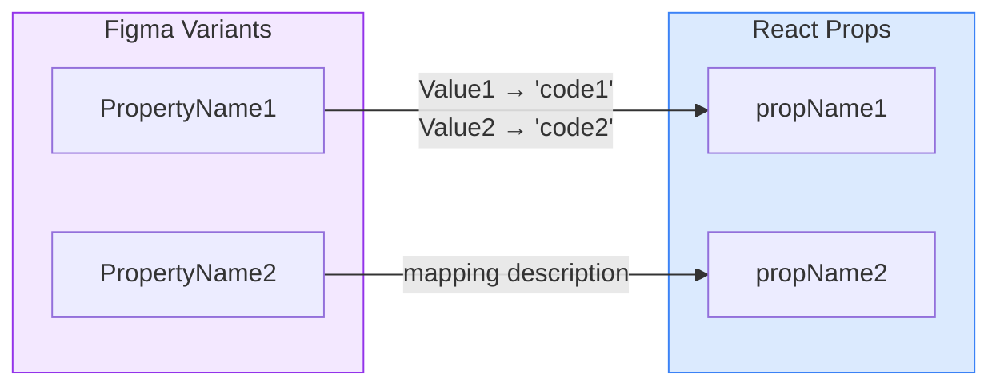

# Generate Figma Code Connect for React Components

## When to Use This Skill
User provides a Figma component URL (or component name) and wants to generate the Code Connect mapping for it.

## Required Inputs
1. **Figma component identifier** (one of):
   - Full URL: `https://figma.com/design/{fileKey}/{fileName}?node-id={nodeId}`
   - File key + node ID: `fileKey: abc123, nodeId: 45:67`
   - Evidence file path: `.temp/figma-explore/{component}.json` or `.temp/figma-connect-shadcn/{component}.json`
   - Component name (will search for URL in project files)
2. **Code component folder path** (e.g., `src/components/Button/Button.tsx`)

## Execution Steps

### 1. Gather Figma Component Data

**Option A: Evidence File Provided (Preferred)**

If an evidence file from `figma-explore` is provided (e.g., `.temp/figma-explore/{component}.json`):
- Read the JSON file directly
- Extract: `id` (node ID), `name`, `variants`, `variantProperties`, `componentPropertyDefinitions`
- The file contains all the variant names and values needed for Code Connect

Example evidence file structure:
```json
{
  "id": "16:1234",
  "name": "Button",
  "type": "COMPONENT_SET",
  "variants": [
    { "name": "Type=Primary, Size=Small", "id": "16:1235" },
    { "name": "Type=Primary, Size=Large", "id": "16:1236" }
  ],
  "variantProperties": {
    "Type": ["Primary", "Secondary", "Ghost"],
    "Size": ["Small", "Medium", "Large"]
  },
  "componentPropertyDefinitions": {
    "Label": { "type": "TEXT", "defaultValue": "Button" },
    "Show Icon": { "type": "BOOLEAN", "defaultValue": false }
  }
}
```

**Option B: URL/Node ID Provided (MCP Fallback)**

If only a Figma URL or node ID is provided:

1. **Search for existing evidence files** in `.temp/figma-explore/` or `.temp/figma-connect-shadcn/` that match the component name
2. **If not found, use MCP tools**:
   - Call `mcp_figma_get_metadata` with `nodeId` and `fileKey`
   - Call `mcp_figma_get_design_context` with `nodeId` and `fileKey`

### 2. Discover Figma URL (if needed)
If no URL or evidence file provided, search for it:
1. Check `{ComponentFolder}/README.md` for "Figma Source" section
2. Check `specs/**/tasks.md` for component-to-Figma mapping tables
3. Check `.temp/figma-explore/figma-components-index.json` or `.temp/figma-connect-shadcn/figma-components-index.json` for matching component names
4. Check prior conversation context for file key

### 3. Read Code Component
- Read the specified component file
- Identify: exports, props interface, component name

### 4. Generate Mapping
- Map Figma properties to code props using `figma.*` helpers
- Build example JSX template
- Add appropriate imports

### 5. Write Code Connect File
- Output to: `{ComponentFolder}/{ComponentName}.figma.tsx`
- Raw file content only—no markdown fences

### 6. Update README with Mapping Diagram
If `{ComponentFolder}/README.md` exists, ensure it has a **Design-to-Code Mapping** section with a mermaid flowchart at the top showing the Figma-to-React property relationships.

**Diagram format:**


**Placement:** The mermaid diagram should be placed immediately after the `## Design-to-Code Mapping` heading, before any tables.

**Example README structure:**
```markdown
## Design-to-Code Mapping

```mermaid
flowchart LR
    subgraph Figma["Figma Variants"]
        FSize["Size"]
        FType["Type"]
    end

    subgraph React["React Props"]
        RSize["size"]
        RVariant["variant"]
    end

    FSize -->|"Small → 'sm'<br>Medium → 'md'<br>Large → 'lg'"| RSize
    FType -->|"Primary → 'primary'<br>Secondary → 'secondary'"| RVariant

    style Figma fill:#f3e8ff,stroke:#9333ea
    style React fill:#dbeafe,stroke:#3b82f6
` ` `

### Variant Mappings
| Figma Variant | Figma Value | React Prop | React Value |
...
```

**Rules for the diagram:**
- Include all mapped variant properties (from `figma.enum()` calls)
- Include boolean properties that map to React props
- Show value transformations on the arrows (e.g., `"Small → 'sm'"`)
- Use `<br>` for multiple value mappings on one arrow
- Exclude pseudo-states (hover, focus, pressed) from the diagram
- Use purple styling for Figma subgraph, blue for React subgraph

## Rules

### Use Exact Figma Property Names
**Critical:** Code Connect requires the EXACT property names as they appear in Figma.

- Get exact names from evidence files (`.figma-components/*.json`) or `get_metadata` output
- Property names like `ButtonType`, `Type`, `Size` must match EXACTLY (case-sensitive)
- The `get_design_context` MCP tool normalizes to camelCase - **do NOT use those names**
- Property names are case-sensitive: `Size` ≠ `size`

Example from metadata:
```
name="ButtonType=Responsive, Type=Primary, Size=Small"
```
Use in Code Connect:
```tsx
variant: { ButtonType: 'Responsive' },  // ✅ Exact match
props: {
  size: figma.enum('Size', { ... }),    // ✅ Exact match
  variant: figma.enum('Type', { ... }), // ✅ Exact match
}
```

### Only Use Real Figma Properties
Map based on what exists in Figma:
- **Component properties** → `figma.boolean()`, `figma.string()`, `figma.instance()`
- **Variant properties** → `figma.enum()`
- **Text layers** → `figma.textContent('LayerName')`
- **Nested instances** → `figma.children('LayerName')` or `figma.children('*')`
- **Child component props** → `figma.nestedProps('LayerName', { ... })`

**Never invent properties that don't exist in Figma.**

### Value Conventions
- Drop pseudo-state variants: `hover`, `pressed`, `focused`, `state`, `interaction`
- Map Figma Title Case to code: `Primary` → `'primary'`, `Small` → `'sm'`
- Normalize boolean variants: "Yes"/"No", "True"/"False", "On"/"Off" → `true`/`false`

### Critical Constraint: No JavaScript Expressions
Code Connect snippets are **strings, NOT executed code**.

**NEVER use:**
```tsx
{hasIcon && <Icon />}
{disabled ? 'disabled' : ''}
{icon || <Fallback />}
```

**Instead, use mapping objects:**
```tsx
figma.boolean('Has Icon', {
  true: <Icon />,
  false: undefined
})
```

## API Reference

### Basic Helpers

```tsx
// String property
figma.string('Label')

// Boolean property (simple)
figma.boolean('Disabled')

// Boolean with mapping
figma.boolean('Has Icon', {
  true: <Icon />,
  false: undefined
})

// Conditional string based on boolean
figma.boolean('Has label', {
  true: figma.string('Label'),
  false: undefined
})

// Enum/Variant property
figma.enum('Size', {
  'Small': 'sm',
  'Medium': 'md',
  'Large': 'lg'
})

// Text content from a layer
figma.textContent('Button Label')

// Instance swap property (nested component)
figma.instance('Icon')

// Child instances by layer name
figma.children('Tab')
figma.children(['Tab 1', 'Tab 2'])
figma.children('Icon*')  // wildcard
figma.children('*')      // all children
```

### Advanced Helpers

```tsx
// Nested props - access child component's properties on parent
figma.nestedProps('Button Shape', {
  size: figma.enum('Size', { ... })
})

// className builder
figma.className([
  'btn-base',
  figma.enum('Size', { 'Large': 'btn-large' }),
  figma.boolean('Disabled', { true: 'btn-disabled', false: '' })
])

// Instance with type inference
figma.instance<React.FunctionComponent>('Icon')  // Returns component type
figma.instance<string>('Icon')                    // Returns string ID

// Access nested instance props in parent
figma.instance('Icon').getProps<{ iconId: string, size: 'sm' | 'lg' }>()

// Custom render for nested instance
figma.instance('Icon').render<{ id: string }>(props => <CustomIcon id={props.id} />)
```

### Variant Restrictions
Use when one Figma component maps to multiple code components:

```tsx
figma.connect(PrimaryButton, 'https://...', {
  variant: { Type: 'Primary' },
  example: () => <PrimaryButton />
})

figma.connect(SecondaryButton, 'https://...', {
  variant: { Type: 'Secondary' },
  example: () => <SecondaryButton />
})

// Boolean variant restriction
figma.connect(IconButton, 'https://...', {
  variant: { 'Has Icon': true },
  example: () => <IconButton />
})

// Multiple variant combination
figma.connect(DangerButton, 'https://...', {
  variant: { Type: 'Danger', Disabled: true },
  example: () => <DangerButton />
})
```

## Complete Example

```tsx
import figma from '@figma/code-connect'
import { Button } from './Button'

figma.connect(Button, 'https://figma.com/design/abc123/File?node-id=1:2', {
  props: {
    variant: figma.enum('Variant', {
      Primary: 'primary',
      Secondary: 'secondary'
    }),
    size: figma.enum('Size', {
      Small: 'sm',
      Medium: 'md',
      Large: 'lg'
    }),
    disabled: figma.boolean('Disabled'),
    label: figma.textContent('Label'),
    icon: figma.boolean('Has Icon', {
      true: figma.instance('Icon'),
      false: undefined
    })
  },
  example: ({ variant, size, disabled, label, icon }) => (
    <Button variant={variant} size={size} disabled={disabled} icon={icon}>
      {label}
    </Button>
  )
})
```

## Icon Connection Patterns

### Icons as JSX Elements
```tsx
// Icon component
figma.connect('https://...icon-url...', {
  example: () => <IconHeart />
})

// Parent using the icon
figma.connect(Button, 'https://...button-url...', {
  props: {
    icon: figma.instance('Icon')
  },
  example: ({ icon }) => <Button>{icon}</Button>
})
// Renders: <Button><IconHeart/></Button>
```

### Icons as React Components
```tsx
// Icon returns component reference (not JSX)
figma.connect('https://...icon-url...', {
  example: () => IconHeart  // No angle brackets
})

// Parent receives component type
figma.connect(Button, 'https://...', {
  props: {
    Icon: figma.instance<React.FunctionComponent>('Icon')
  },
  example: ({ Icon }) => <Button Icon={Icon} />
})
// Renders: <Button Icon={IconHeart} />
```

### Icons as String IDs
```tsx
// Icon returns string ID
figma.connect('https://...icon-url...', {
  example: () => 'icon-heart'
})

// Parent uses string
figma.connect(Button, 'https://...', {
  props: {
    iconId: figma.instance<string>('Icon')
  },
  example: ({ iconId }) => <Button iconId={iconId} />
})
// Renders: <Button iconId="icon-heart" />
```

## Output

Write raw file content only—no markdown fences, no explanations.

**File location:** `{ComponentFolder}/{ComponentName}.figma.tsx`

Example: `src/components/inline-edit/EditableText/EditableText.figma.tsx`

File must be immediately usable with `npx @figma/code-connect connect publish`.