# Skill: Figma URL Router

**⚠️ CRITICAL: Use this skill FIRST when you see ANY Figma URL in a specification.**

This skill automatically detects what type of Figma node you're working with and routes you to the correct implementation workflow.

## Purpose

When implementing features with Figma designs, the approach differs significantly based on the node type:
- **Component Set** → Use TDD with component-set-testing skill
- **Single Component** → Standard implementation flow
- **Frame/Section** → UI layout implementation

Instead of requiring spec authors to identify the type, this skill automatically detects it.

## When to Use

**REQUIRED** - Use this skill when:
- ANY Figma URL appears in a specification
- You see `figma.com/design/` or `figma.com/file/` links
- Before writing any component or implementation code
- At the start of implement-story mode

**Flow:**
```
See Figma URL → Use figma-url-router skill → Get routed to correct workflow
```

## Detection Process

### Step 1: Extract Figma Parameters

Parse the URL to extract:
- `fileKey`: The file identifier
- `nodeId`: The specific node (convert `node-id=1-2` to `1:2`)

**URL patterns:**
```
https://figma.com/design/:fileKey/:fileName?node-id=1-2
https://figma.com/file/:fileKey/:fileName?node-id=1-2
```

### Step 2: Query Node Type

Call `mcp_figma_get_design_context` to identify the node:

```typescript
const context = await mcp_figma_get_design_context({
  nodeId: "1:2",
  fileKey: "abc123"
});

// Check the type
const nodeType = context.document.type;
```

### Step 3: Route to Appropriate Workflow

Based on `document.type`, route to the correct approach:

| Node Type | Workflow | Skill to Use |
|-----------|----------|--------------|
| `COMPONENT_SET` | Test-Driven Development | component-set-testing |
| `COMPONENT` | Standard implementation | (none - regular flow) |
| `FRAME` | UI layout implementation | (none - regular flow) |
| `SECTION` | UI layout implementation | (none - regular flow) |
| `GROUP` | UI layout implementation | (none - regular flow) |

## Routing Logic

### Route 1: Component Set (TDD Required)

```typescript
if (context.document.type === "COMPONENT_SET") {
  console.log("✅ Detected COMPONENT_SET - Using TDD approach");
  console.log("📋 Routing to: component-set-testing skill");
  
  // DO NOT write component code yet
  // Follow component-set-testing skill:
  // 1. Discover all variant combinations
  // 2. Write failing tests first
  // 3. Implement component to pass tests
  
  return {
    workflow: "test-driven-development",
    skill: "component-set-testing",
    shouldWriteTestsFirst: true
  };
}
```

**Next steps:**
1. Read the component-set-testing skill
2. Follow TDD process exactly
3. Tests before implementation

### Route 2: Single Component

```typescript
if (context.document.type === "COMPONENT") {
  console.log("✅ Detected single COMPONENT");
  console.log("📋 Using standard implementation flow");
  
  // Standard flow:
  // 1. Get screenshot
  // 2. Get variable definitions
  // 3. Implement component
  // 4. Write tests
  
  return {
    workflow: "standard-implementation",
    skill: null,
    shouldWriteTestsFirst: false
  };
}
```

**Next steps:**
1. Call `mcp_figma_get_screenshot` for visual reference
2. Call `mcp_figma_get_variable_defs` to track all values
3. Implement component matching design exactly
4. Write tests to verify implementation

### Route 3: Frame/Section/Group (Layout)

```typescript
if (["FRAME", "SECTION", "GROUP"].includes(context.document.type)) {
  console.log("✅ Detected layout node:", context.document.type);
  console.log("📋 Using UI layout implementation");
  
  // Layout flow:
  // 1. Get screenshot for hierarchy
  // 2. Identify nested components
  // 3. Implement layout structure
  // 4. Add component integration tests
  
  return {
    workflow: "layout-implementation",
    skill: null,
    shouldWriteTestsFirst: false
  };
}
```

**Next steps:**
1. Capture screenshots
2. Identify component composition
3. Implement layout
4. Test integration points

## Complete Workflow

```mermaid
flowchart TD
    A[Spec contains Figma URL] --> B[Extract fileKey & nodeId]
    B --> C[Call mcp_figma_get_design_context]
    C --> D{Check document.type}
    D -->|COMPONENT_SET| E[✅ Route to component-set-testing]
    D -->|COMPONENT| F[✅ Route to standard flow]
    D -->|FRAME/SECTION/GROUP| G[✅ Route to layout flow]
    E --> H[Write tests FIRST]
    H --> I[Then implement component]
    F --> J[Get design details]
    J --> K[Implement then test]
    G --> L[Implement layout]
    L --> M[Test integration]
```



## Integration with implement-story Mode

**🛑 MODE INSTRUCTION REQUIREMENT:**

The implement-story mode instructions MUST call this skill as the FIRST step when Figma URLs are present. This is not optional.

**Required mode instruction update:**
```markdown
## Step 2: Design Discovery

**🛑 MANDATORY FIRST STEP: Route Figma URLs**

Before ANY design analysis or implementation:

1. **Scan for Figma URLs** in the spec
2. **For EACH Figma URL found:**
   - Use figma-url-router skill immediately
   - Do NOT analyze or implement anything yet
   - Wait for routing decision before proceeding
3. **Follow routed workflow** exactly as specified

**Routing outcomes:**
- COMPONENT_SET detected → Use component-set-testing skill (TDD required)
- Other node types → Continue with standard flow

**Only AFTER routing all Figma URLs:**
- Get screenshots for reference
- Get variable definitions
- Track all values
- Proceed with implementation per routed workflow
```

## Validation & Enforcement

**After routing to component-set-testing skill:**

The router should verify the TDD workflow was actually followed by checking:

1. **Test file exists** before component file
2. **Validation script was run** (check for validate-tests.sh execution)
3. **Tracking table was created** (should be documented in conversation)
4. **All tests have variant comments** (validated by script)

**If validation fails:**
```markdown
🛑 ERROR: TDD workflow not followed for Component Set

Detected: COMPONENT_SET node type
Expected: Test-Driven Development workflow via component-set-testing skill
Found: Component implementation without proper TDD process

REQUIRED ACTIONS:
1. Delete component implementation file
2. Return to component-set-testing skill Phase 0
3. Create tracking table from Figma variants
4. Write tests first (Phase 1-5)
5. Run validation script (.github/skills/component-set-testing/scripts/validate-tests.sh)
6. Only after script passes → implement component (Phase 6)

Proceeding without this process results in:
- Broken interaction handlers
- Incorrect spacing
- Misaligned hover behavior
- Overlays that shift page content
- Component not matching Figma design
```

## Reporting Routing Decisions

When this skill is invoked, provide clear output to the user:

**Format:**
```markdown
🔍 Figma URL Router Analysis

**URL:** https://figma.com/design/:fileKey/:fileName?node-id=1109-10682
**File Key:** :fileKey
**Node ID:** 1109:10682

**Detection Result:**
- Node Type: COMPONENT_SET
- Variant Properties Detected: State, Count
- Total Variants: 12 combinations

**Routing Decision:**
✅ Routed to: component-set-testing skill
⚠️ Workflow: Test-Driven Development (TDD)
🛑 CRITICAL: Tests must be written BEFORE component implementation

**Next Steps:**
1. Do NOT create component file yet
2. Follow component-set-testing skill phases 0-5
3. Create tracking table of all visual differences
4. Write comprehensive tests from tracking table
5. Run validation script: .github/skills/component-set-testing/scripts/validate-tests.sh
6. Only after validation passes → create component file (Phase 6)
```

This explicit reporting makes it impossible to miss that TDD is required.

## Multiple Figma URLs

If spec contains multiple Figma URLs:

1. **Process each URL separately** through this router
2. **Track routing decisions** for each
3. **Group by workflow type**:
   - All Component Sets → Use TDD
   - All single components → Standard flow
   - Mixed → Use most appropriate for each

Example:
```markdown
Figma URLs in spec:
1. Button Component Set → TDD workflow
2. Header layout (Frame) → Layout workflow
3. Icon (Component) → Standard workflow

Implementation order:
1. Button (TDD - tests first)
2. Icon (standard)
3. Header (layout - uses Button & Icon)
```

## Example Usage

**Spec contains:**
```markdown
Design: https://figma.com/design/7QW0kJ07DcM36mgQUJ5Dtj/Design?node-id=1109-10911
```

**Agent process:**
1. See Figma URL → Trigger figma-url-router skill
2. Extract: `fileKey=7QW0kJ07DcM36mgQUJ5Dtj`, `nodeId=1109:10911`
3. Call `mcp_figma_get_design_context(nodeId, fileKey)`
4. Response shows: `document.type = "COMPONENT_SET"`
5. Route to: component-set-testing skill (TDD)
6. Do NOT create component file
7. Write tests first
8. Then implement

## Critical Rules

1. **🛑 ALWAYS use this skill first** when seeing Figma URLs - This is MANDATORY, not optional
2. **🛑 NEVER assume node type** - always query with `get_design_context`
3. **🛑 Route before ANY implementation** - don't write ANY code before routing
4. **🛑 Follow routed workflow strictly** - especially TDD for Component Sets
5. **🛑 Report routing decision** - use the explicit format shown above so it's crystal clear
6. **🛑 Validate TDD compliance** - for Component Sets, verify validation script was run

## Enforcement Mechanisms

**For AI agents implementing features:**

1. **Mode instructions MUST call this skill** - Update implement-story mode to require this as Step 2 first action
2. **No implementation before routing** - Reject any component/code creation before routing decision
3. **Validation required for Component Sets** - Must run validate-tests.sh script before component creation
4. **Explicit reporting required** - Must output routing decision in the specified format

**For code reviewers:**

When reviewing Component Set implementations:
```bash
# Check if validation script was run during implementation
grep -r "validate-tests.sh" conversation_history

# Check if test file was created before component file
ls -lt ComponentName.test.tsx ComponentName.tsx
# Test file should have earlier timestamp

# Run validation script now
.github/skills/component-set-testing/scripts/validate-tests.sh \
  path/to/ComponentName.test.tsx
```

## Common Mistakes to Avoid

❌ **Don't** skip this skill and implement directly
❌ **Don't** assume it's a single component without checking
❌ **Don't** write component code before routing
❌ **Don't** ignore Component Set detection (leads to missing tests)
❌ **Don't** proceed with implementation if validation script fails
❌ **Don't** create component file before test file for Component Sets

✅ **Do** use this skill for EVERY Figma URL
✅ **Do** query the node type first
✅ **Do** follow the routed workflow exactly
✅ **Do** use TDD when routed to component-set-testing
✅ **Do** run validation script for Component Sets
✅ **Do** report routing decision explicitly
✅ **Do** create test file before component file

## Benefits

- **Automatic detection**: No manual inspection needed
- **Correct workflow**: Always use right approach for node type
- **TDD enforcement**: Component Sets automatically get proper test coverage
- **Consistency**: Same process every time
- **Spec simplicity**: Authors don't need to know Figma node types

## Related Skills

- **component-set-testing**: Used when routed to TDD workflow
- **figma-component-sync**: Used for verification after implementation
- **tailwind-utility-simplification**: Used during implementation phase
