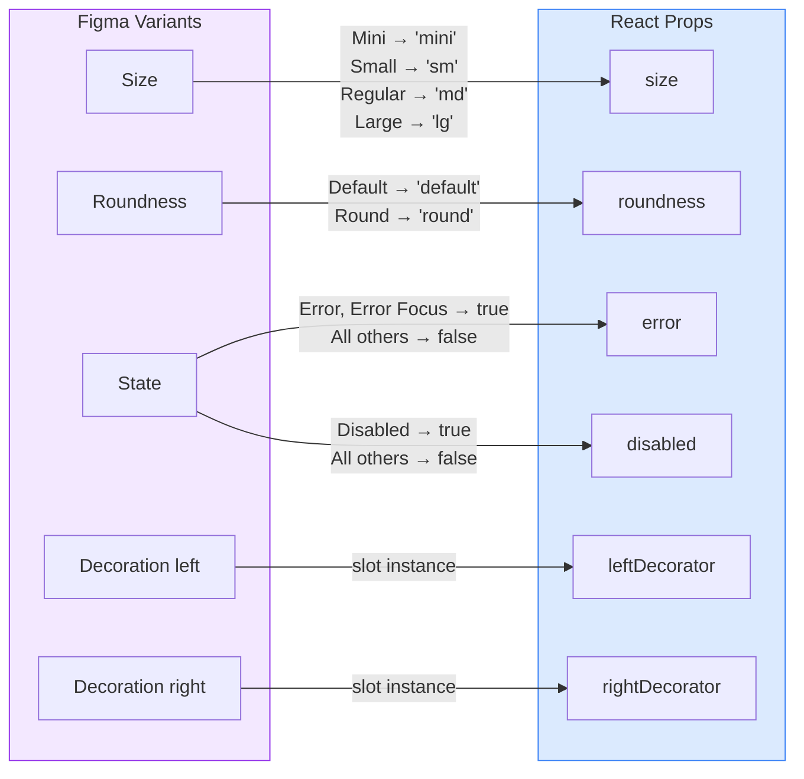

# Input

An enhanced Input component from the Obra shadcn-ui design system with comprehensive variant support for sizes, roundness styles, and decorator slots.

## Figma Source

https://www.figma.com/design/MQUbIrlfuM8qnr9XZ7jc82/Obra-shadcn-ui--Community-?node-id=279-98539

## Accepted Design Differences

| Category | Figma | Implementation | File | Reason |
|----------|-------|----------------|------|--------|
| Focus Ring | 3px spread shadow | ring-2 ring-offset-2 | Input.tsx | Tailwind standard pattern |
| Cursor | Visible cursor element | Native browser cursor | Input.tsx | Browser handles cursor natively |

## Design-to-Code Mapping



### Variant Mappings

| Figma Variant | Figma Value | React Prop | React Value | Notes |
|---------------|-------------|------------|-------------|-------|
| Size | Mini | `size` | `'mini'` | Height 24px (h-6) |
| Size | Small | `size` | `'sm'` | Height 32px (h-8) |
| Size | Regular | `size` | `'md'` | Height 36px (h-9) - default |
| Size | Large | `size` | `'lg'` | Height 40px (h-10) |
| Roundness | Default | `roundness` | `'default'` | rounded-md |
| Roundness | Round | `roundness` | `'round'` | rounded-full (pill) |

### Property Mappings

| Figma Property | Type | React Prop | Notes |
|----------------|------|------------|-------|
| Decoration left | Boolean | `leftDecorator?: ReactNode` | Renders icon or text prefix |
| Decoration right | Boolean | `rightDecorator?: ReactNode` | Renders icon or text suffix |
| State: Disabled | Boolean | `disabled` | Native input disabled attribute |
| State: Error | Variant | `error: boolean` | Red border and focus ring |

### Excluded Properties (CSS/Internal)

| Figma Property | Handling | Reason |
|----------------|----------|--------|
| State: Empty | Automatic | No value in input |
| State: Value | Automatic | Input has value |
| State: Placeholder | Native | HTML placeholder attribute |
| State: Focus | CSS `:focus-visible` | Pseudo-state |
| State: Error Focus | CSS + `error` prop | Combines error + focus styles |
| showCursor | Browser native | Text cursor handled by browser |

## Usage

```tsx
import { Input } from '@/components/obra/Input';
import { Search, Info } from 'lucide-react';

// Basic usage
<Input placeholder="Enter value..." />

// Different sizes
<Input size="mini" placeholder="Mini" />
<Input size="sm" placeholder="Small" />
<Input size="md" placeholder="Regular" />
<Input size="lg" placeholder="Large" />

// Rounded variant
<Input roundness="round" placeholder="Pill-shaped" />

// With error state
<Input error placeholder="Invalid input" />

// With decorators
<Input
  leftDecorator={<Search className="h-4 w-4" />}
  placeholder="Search..."
/>

<Input
  leftDecorator={<span>https://</span>}
  rightDecorator={<Info className="h-4 w-4" />}
  placeholder="example.com"
/>

// Currency input pattern
<Input
  leftDecorator={<span>$</span>}
  rightDecorator={<span>USD</span>}
  placeholder="0.00"
/>
```
