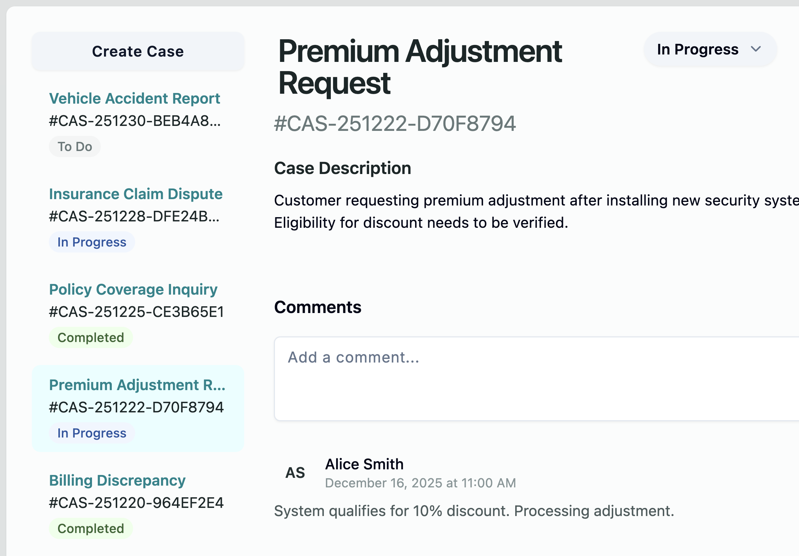
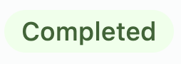
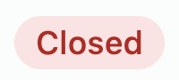

# Case Status Badges in Sidebar

## Summary

Each case in the left-hand sidebar list currently shows only the case title and case number. We want to add a small colored status badge below those fields so users can see the current status of each case at a glance — without having to open it.

## Reference Screenshots

### Full sidebar with status badges

### Individual status badge states
| Status | Screenshot |
|--------|------------|
| To Do |  |
| In Progress |  |
| Completed |  |
| Closed |  |
